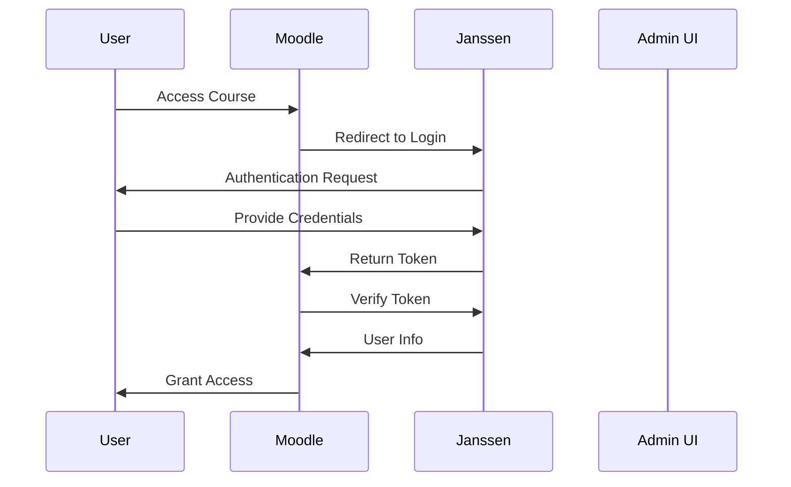
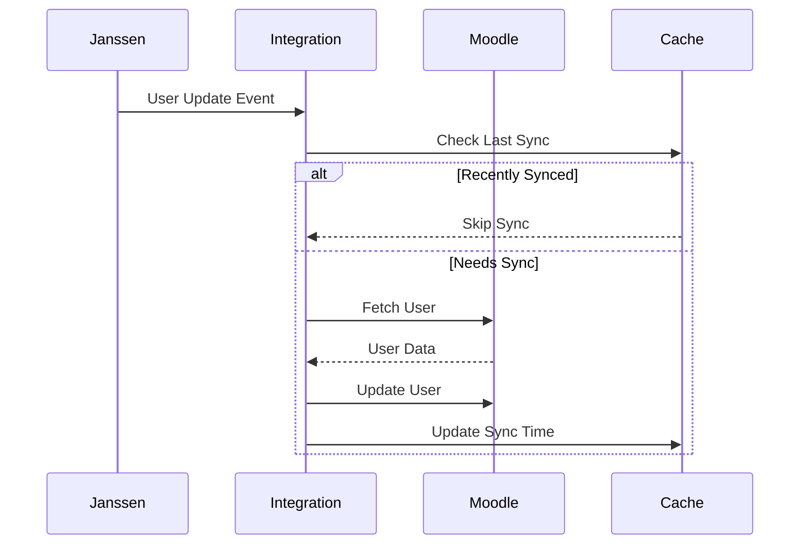

# Moodle LMS Integration Guide

This guide details the integration between Janssen IAM and Moodle Learning Management System (LMS) using the Flutter IAM Admin UI.

## Table of Contents
- [Overview](#overview)
- [Prerequisites](#prerequisites)
- [Janssen Configuration](#janssen-configuration)
- [Moodle Configuration](#moodle-configuration)
- [Integration Setup](#integration-setup)
- [User Provisioning](#user-provisioning)
- [Testing](#testing)
- [Troubleshooting](#troubleshooting)

## Overview

### Integration Features
- Single Sign-On (SSO) via OAuth2/OpenID Connect
- Automated user provisioning
- Role mapping
- Course enrollment synchronization
- Grade passback
- Activity completion tracking

### Architecture


## Prerequisites

### Moodle Requirements
- Moodle 4.0+
- OAuth 2 Authentication Plugin enabled
- OpenID Connect Authentication Plugin enabled
- Web Services enabled
- REST Protocol enabled

### Janssen Requirements
- Janssen Server 1.1.1+
- OAuth2 client configuration
- SCIM provisioning enabled
- UMA permissions configured

### Network Requirements
- HTTPS enabled
- Valid SSL certificates
- Proper DNS configuration
- Firewall rules configured

## Janssen Configuration

### 1. Create OAuth2 Client
```json
{
  "client_name": "moodle_oauth2_client",
  "client_id": "${generated_client_id}",
  "client_secret": "${generated_client_secret}",
  "token_endpoint_auth_method": "client_secret_post",
  "application_type": "web",
  "grant_types": [
    "authorization_code",
    "refresh_token"
  ],
  "response_types": [
    "code"
  ],
  "scope": [
    "openid",
    "profile",
    "email",
    "moodle_integration"
  ],
  "redirect_uris": [
    "https://your.moodle.domain/admin/oauth2callback.php"
  ]
}
```

### 2. Configure SCIM Provisioning
```json
{
  "schemas": ["urn:ietf:params:scim:schemas:core:2.0:ServiceProviderConfig"],
  "documentationUri": "https://your.moodle.domain/scim/docs",
  "patch": {
    "supported": true
  },
  "bulk": {
    "supported": true,
    "maxOperations": 1000,
    "maxPayloadSize": 1048576
  },
  "filter": {
    "supported": true,
    "maxResults": 200
  }
}
```

### 3. Configure UMA Permissions
```json
{
  "resource_set_id": "moodle_integration_resources",
  "scopes": [
    "view",
    "edit",
    "enroll"
  ],
  "claims": {
    "role": ["teacher", "student", "admin"]
  }
}
```

## Moodle Configuration

### 1. OAuth2 Client Setup
```php
// config.php additions
$CFG->auth_plugins_enabled = 'oauth2,manual';
$CFG->enablewebservices = true;
$CFG->enableoauth2 = true;

// OAuth2 service configuration
$oauth2config = [
    'name' => 'Janssen SSO',
    'clientid' => '${client_id_from_janssen}',
    'clientsecret' => '${client_secret_from_janssen}',
    'loginscopes' => 'openid profile email',
    'loginscopesoffline' => 'openid profile email offline_access',
    'authendpoint' => 'https://your.janssen.domain/oauth/authorize',
    'tokenendpoint' => 'https://your.janssen.domain/oauth/token'
];
```

### 2. User Field Mapping
```php
// Custom user field mapping
$fieldmap = [
    'username' => 'preferred_username',
    'email' => 'email',
    'firstname' => 'given_name',
    'lastname' => 'family_name',
    'idnumber' => 'sub',
    'lang' => 'locale',
    'timezone' => 'zoneinfo'
];
```

### 3. Role Mapping Configuration
```php
// Role mapping configuration
$rolemap = [
    'teacher' => 4,
    'student' => 5,
    'manager' => 1,
    'coursecreator' => 2
];
```

## Integration Setup

### 1. Database Configuration
```sql
-- Create integration tracking table
CREATE TABLE mdl_janssen_integration (
    id BIGINT NOT NULL AUTO_INCREMENT,
    userid BIGINT NOT NULL,
    janssen_id VARCHAR(255) NOT NULL,
    last_sync TIMESTAMP DEFAULT CURRENT_TIMESTAMP,
    sync_status VARCHAR(50),
    PRIMARY KEY (id),
    UNIQUE KEY uk_userid (userid),
    UNIQUE KEY uk_janssen_id (janssen_id)
);

-- Create role mapping table
CREATE TABLE mdl_janssen_role_mapping (
    id BIGINT NOT NULL AUTO_INCREMENT,
    janssen_role VARCHAR(255) NOT NULL,
    moodle_role BIGINT NOT NULL,
    context_level INT NOT NULL,
    PRIMARY KEY (id),
    UNIQUE KEY uk_role_mapping (janssen_role, moodle_role, context_level)
);
```

### 2. Integration Service Implementation
```dart
class MoodleIntegrationService implements ServiceIntegration {
  final HttpService _httpService;
  final ConfigService _configService;
  final CacheService _cacheService;

  MoodleIntegrationService(
    this._httpService,
    this._configService,
    this._cacheService,
  );

  @override
  Future<void> initialize() async {
    final config = await _configService.getIntegrationConfig('moodle');
    await validateConfiguration(config);
    await setupWebServices(config);
    await validateConnection();
  }

  @override
  Future<bool> testConnection() async {
    try {
      final response = await _httpService.get('/webservice/rest/server.php', 
        queryParameters: {
          'wsfunction': 'core_webservice_get_site_info',
          'moodlewsrestformat': 'json'
        });
      return response.statusCode == 200;
    } catch (e) {
      return false;
    }
  }

  Future<void> syncUser(User user) async {
    // Implementation for user synchronization
  }

  Future<void> syncEnrollments(User user, List<String> courses) async {
    // Implementation for enrollment synchronization
  }
}
```

### 3. User Synchronization Flow


## User Provisioning

### 1. Automatic Provisioning
```dart
class UserProvisioningService {
  final MoodleIntegrationService _moodleService;
  final UserService _userService;

  Future<void> provisionUser(User user) async {
    // Validate user data
    if (!_validateUserData(user)) {
      throw ProvisioningException('Invalid user data');
    }

    // Create or update user
    try {
      final moodleUser = await _moodleService.findUser(user.email);
      if (moodleUser != null) {
        await _updateMoodleUser(user, moodleUser);
      } else {
        await _createMoodleUser(user);
      }
    } catch (e) {
      throw ProvisioningException('Failed to provision user: ${e.toString()}');
    }
  }

  Future<void> _createMoodleUser(User user) async {
    // Implementation
  }

  Future<void> _updateMoodleUser(User user, MoodleUser moodleUser) async {
    // Implementation
  }
}
```

### 2. Role Assignment
```dart
class RoleAssignmentService {
  final MoodleIntegrationService _moodleService;
  final RoleMappingService _roleMappingService;

  Future<void> assignRoles(User user, List<String> roles) async {
    final mappedRoles = await _roleMappingService.mapRoles(roles);
    
    for (final role in mappedRoles) {
      await _moodleService.assignRole(
        userId: user.id,
        roleId: role.moodleRoleId,
        contextLevel: role.contextLevel,
        instanceId: role.instanceId,
      );
    }
  }
}
```

## Testing

### 1. Integration Tests
```dart
void main() {
  group('Moodle Integration Tests', () {
    late MoodleIntegrationService integrationService;
    late MockHttpService mockHttp;
    
    setUp(() {
      mockHttp = MockHttpService();
      integrationService = MoodleIntegrationService(
        mockHttp,
        MockConfigService(),
        MockCacheService(),
      );
    });

    test('successfully syncs user', () async {
      // Test implementation
    });

    test('handles sync failures gracefully', () async {
      // Test implementation
    });
  });
}
```

### 2. Manual Testing Checklist
- [ ] SSO Login flow
- [ ] User provisioning
- [ ] Role assignment
- [ ] Course enrollment
- [ ] Profile updates
- [ ] Session management
- [ ] Error handling
- [ ] Token refresh
- [ ] Logout flow

## Troubleshooting

### Common Issues

1. SSO Login Failures
```dart
Future<void> validateSsoConfiguration() async {
  // Check OAuth2 configuration
  final oauthConfig = await _configService.getOAuth2Config();
  if (!_validateOAuthConfig(oauthConfig)) {
    throw ConfigurationException('Invalid OAuth2 configuration');
  }

  // Verify endpoints
  final endpoints = [
    '/oauth/authorize',
    '/oauth/token',
    '/oauth/userinfo'
  ];

  for (final endpoint in endpoints) {
    try {
      await _httpService.get(endpoint);
    } catch (e) {
      throw EndpointException('Failed to access $endpoint: ${e.toString()}');
    }
  }
}
```

2. User Sync Issues
```dart
class SyncDiagnostics {
  Future<SyncReport> diagnoseUserSync(String userId) async {
    final report = SyncReport();
    
    try {
      // Check Janssen user
      report.janssenUser = await _checkJanssenUser(userId);
      
      // Check Moodle user
      report.moodleUser = await _checkMoodleUser(userId);
      
      // Verify mappings
      report.mappingStatus = await _checkMappings(
        report.janssenUser,
        report.moodleUser,
      );
      
      // Test permissions
      report.permissionStatus = await _checkPermissions(userId);
      
    } catch (e) {
      report.errors.add(e.toString());
    }
    
    return report;
  }
}
```

3. Network Configuration
```bash
#!/bin/bash
# Diagnostic script

# Check SSL certificates
echo "Checking SSL certificates..."
openssl s_client -connect your.moodle.domain:443 -servername your.moodle.domain

# Check DNS resolution
echo "Checking DNS resolution..."
dig your.moodle.domain
dig your.janssen.domain

# Check connectivity
echo "Checking connectivity..."
curl -v https://your.moodle.domain/admin/tool/oauth2/login.php
```

### Logging

1. Enable Debug Logging
```yaml
logging:
  moodle_integration:
    level: DEBUG
    handlers:
      - file
      - console
    file:
      path: /var/log/janssen/moodle_integration.log
      max_size: 10485760  # 10MB
      backup_count: 5
```

2. Log Analysis
```dart
class LogAnalyzer {
  Future<List<LogEvent>> analyzeLogs(
    DateTime start,
    DateTime end,
  ) async {
    final logs = await _readLogs(start, end);
    return _processLogs(logs);
  }

  List<LogEvent> _processLogs(List<String> logs) {
    // Implementation
  }
}
```

## Additional Resources
- [Moodle Web Services API Documentation](https://docs.moodle.org/dev/Web_services)
- [Janssen OAuth2 Configuration Guide](oauth2-configuration.md)
- [User Provisioning Guide](user-provisioning.md)
- [Security Best Practices](security.md)
