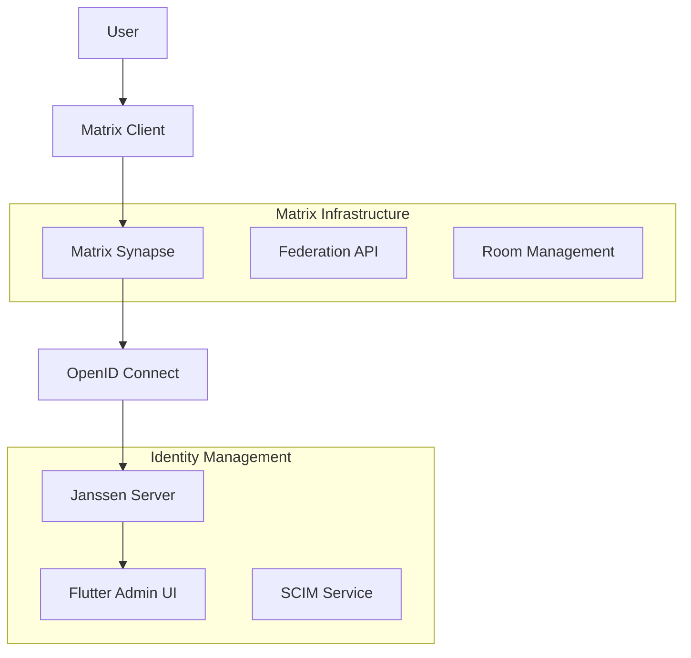
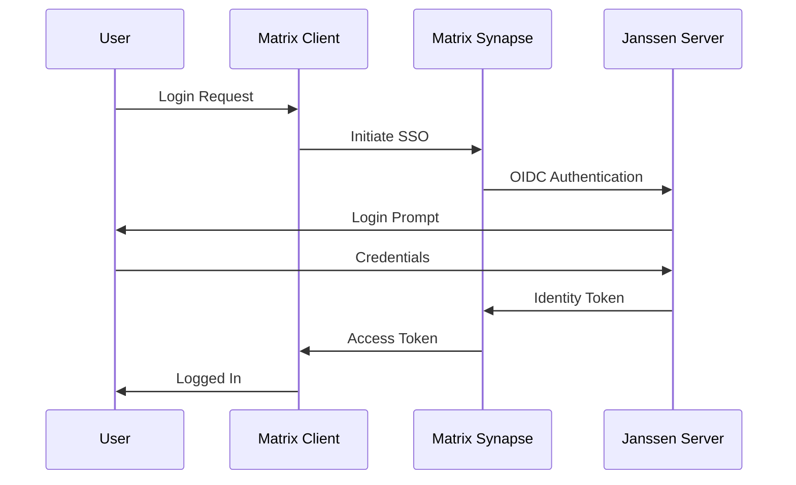

# Matrix.org Integration Guide

This guide details the integration between Janssen IAM and Matrix Synapse homeservers using the Flutter IAM Admin UI, enabling single sign-on (SSO) and identity management for Matrix-based communication.

## Table of Contents
- [Overview](#overview)
- [Prerequisites](#prerequisites)
- [Architecture](#architecture)
- [Janssen Configuration](#janssen-configuration)
- [Matrix Synapse Configuration](#matrix-synapse-configuration)
- [Integration Implementation](#integration-implementation)
- [User Management](#user-management)
- [Room Management](#room-management)
- [Security Considerations](#security-considerations)
- [Troubleshooting](#troubleshooting)

## Overview

### Integration Features
- Single Sign-On (SSO) via OpenID Connect
- User provisioning and deprovisioning
- Room access management
- Role-based access control
- User profile synchronization
- Federation management
- Audit logging

### Key Benefits
- Centralized authentication
- Automated user management
- Consistent access control
- Secure communications
- Audit compliance
- Federation control

## Prerequisites

### Matrix Server Requirements
- Synapse 1.75.0+
- PostgreSQL database
- Valid SSL certificates
- Configured federation
- Admin access

### Janssen Requirements
- Janssen Server 1.1.1+
- OAuth2/OpenID Connect configured
- SCIM service enabled
- Admin credentials

### Network Requirements
- HTTPS enabled
- Valid SSL certificates
- Proper DNS configuration
- Federation ports open (8448)

## Architecture

### High-Level Integration Flow


### Authentication Flow


## Janssen Configuration

### 1. OAuth2 Client Configuration
```json
{
  "client_name": "matrix_synapse",
  "client_id": "${generated_client_id}",
  "client_secret": "${generated_client_secret}",
  "token_endpoint_auth_method": "client_secret_post",
  "application_type": "web",
  "grant_types": [
    "authorization_code",
    "refresh_token"
  ],
  "response_types": ["code"],
  "scope": [
    "openid",
    "profile",
    "email",
    "matrix"
  ],
  "redirect_uris": [
    "https://matrix.your.domain/_synapse/client/oidc/callback"
  ]
}
```

### 2. SCIM Configuration
```json
{
  "schemas": ["urn:ietf:params:scim:schemas:core:2.0:ServiceProviderConfig"],
  "patch": {
    "supported": true
  },
  "bulk": {
    "supported": true,
    "maxOperations": 1000
  },
  "filter": {
    "supported": true,
    "maxResults": 200
  },
  "changePassword": {
    "supported": true
  },
  "sort": {
    "supported": true
  },
  "etag": {
    "supported": true
  }
}
```

### 3. Custom Claims
```json
{
  "claim_name": "matrix_roles",
  "claim_token_format": "http://openid.net/specs/openid-connect-core-1_0.html#IDToken",
  "claim_type": "string",
  "group_claims": [
    "admin",
    "moderator",
    "user"
  ]
}
```

## Matrix Synapse Configuration

### 1. OpenID Connect Setup
```yaml
# homeserver.yaml
oidc_providers:
  - idp_id: janssen
    idp_name: "Janssen SSO"
    issuer: "https://your.janssen.domain"
    client_id: "${client_id_from_janssen}"
    client_secret: "${client_secret_from_janssen}"
    scopes: ["openid", "profile", "email"]
    user_mapping_provider:
      config:
        subject_claim: "sub"
        localpart_template: "{{ user.preferred_username }}"
        display_name_template: "{{ user.given_name }} {{ user.family_name }}"
        email_template: "{{ user.email }}"
```

### 2. User Directory Configuration
```yaml
user_directory:
  enabled: true
  search_all_users: true
  prefer_local_users: true
  
  update_user_directory: true
  search_all_users: true
```

### 3. Federation Settings
```yaml
federation_domain_whitelist:
  - trusted-domain.com
  - another-trusted.org

federation_client_minimum_tls_version: 1.2

federation_verify_certificates: true
```

## Integration Implementation

### 1. Matrix Integration Service
```dart
class MatrixIntegrationService implements ServiceIntegration {
  final HttpService _httpService;
  final ConfigService _configService;
  final CacheService _cacheService;

  Future<void> initialize() async {
    final config = await _loadConfiguration();
    await _validateConfig(config);
    await _setupHomeserver(config);
  }

  Future<bool> testConnection() async {
    try {
      final response = await _httpService.get(
        '/_matrix/client/versions',
      );
      return response.statusCode == 200;
    } catch (e) {
      return false;
    }
  }

  Future<void> provisionUser(User user) async {
    final matrixUser = await _createMatrixUser(user);
    await _assignRoles(matrixUser, user.roles);
    await _setupUserRooms(matrixUser);
  }
}
```

### 2. Room Management
```dart
class RoomManagementService {
  final MatrixIntegrationService _matrixService;
  final UserService _userService;

  Future<void> createRoom({
    required String name,
    required String topic,
    required List<String> members,
    required RoomVisibility visibility,
  }) async {
    final response = await _matrixService.createRoom(
      name: name,
      topic: topic,
      visibility: visibility,
    );

    final roomId = response['room_id'];
    await _inviteMembers(roomId, members);
  }

  Future<void> updateRoomAccess(
    String roomId,
    List<String> allowedUsers,
  ) async {
    final currentPowerLevels = await _getRoomPowerLevels(roomId);
    final updatedPowerLevels = _updatePowerLevels(
      currentPowerLevels,
      allowedUsers,
    );
    
    await _matrixService.setPowerLevels(
      roomId,
      updatedPowerLevels,
    );
  }
}
```

## User Management

### 1. User Provisioning Flow
```dart
class MatrixUserProvisioning {
  final MatrixIntegrationService _matrixService;
  final UserMappingService _mappingService;

  Future<void> provisionUser(User user) async {
    // Create Matrix user
    final matrixUser = await _createMatrixAccount(user);
    
    // Set up user profile
    await _setupUserProfile(matrixUser, user);
    
    // Assign to rooms
    await _assignDefaultRooms(matrixUser);
    
    // Set up permissions
    await _setupUserPermissions(matrixUser, user.roles);
  }

  Future<void> deprovisionUser(String userId) async {
    // Deactivate account
    await _matrixService.deactivateUser(userId);
    
    // Remove from rooms
    await _removeFromAllRooms(userId);
    
    // Clean up user data
    await _cleanupUserData(userId);
  }
}
```

### 2. Profile Synchronization
```dart
class ProfileSyncService {
  final MatrixIntegrationService _matrixService;
  final UserService _userService;

  Future<void> syncUserProfile(String userId) async {
    final user = await _userService.getUser(userId);
    final matrixUser = await _matrixService.getUser(userId);

    if (_needsUpdate(user, matrixUser)) {
      await _updateMatrixProfile(
        matrixUserId: matrixUser.id,
        displayName: "${user.firstName} ${user.lastName}",
        avatarUrl: user.avatarUrl,
      );
    }
  }
}
```

## Room Management

### 1. Room Creation Service
```dart
class RoomManagementService {
  Future<String> createRoom({
    required String name,
    required RoomType type,
    required List<String> members,
  }) async {
    final response = await _matrixService.post(
      '/_matrix/client/r0/createRoom',
      body: {
        'name': name,
        'preset': type.toString(),
        'initial_state': [
          {
            'type': 'm.room.join_rules',
            'state_key': '',
            'content': {'join_rule': 'invite'}
          }
        ]
      },
    );

    final roomId = response['room_id'];
    await _inviteMembers(roomId, members);
    return roomId;
  }
}
```

### 2. Access Control
```dart
class RoomAccessControl {
  Future<void> updateRoomAccess(
    String roomId,
    Map<String, PowerLevel> userLevels,
  ) async {
    final currentState = await _getRoomState(roomId);
    final updatedState = _updatePowerLevels(
      currentState,
      userLevels,
    );

    await _matrixService.setState(
      roomId,
      'm.room.power_levels',
      '',
      updatedState,
    );
  }
}
```

## Security Considerations

### 1. Token Security
```dart
class TokenSecurityService {
  Future<void> validateToken(String token) async {
    final parts = token.split('.');
    if (parts.length != 3) {
      throw SecurityException('Invalid token format');
    }

    final header = _decodeBase64(parts[0]);
    final payload = _decodeBase64(parts[1]);
    
    await _validateSignature(token);
    _validateExpiry(payload);
    _validateIssuer(payload);
    _validateAudience(payload);
  }
}
```

### 2. Room Security
```dart
class RoomSecurity {
  Future<void> enforceRoomSecurity(String roomId) async {
    await _enforceEncryption(roomId);
    await _setJoinRules(roomId);
    await _setupPowerLevels(roomId);
    await _configureHistory(roomId);
  }

  Future<void> _enforceEncryption(String roomId) async {
    await _matrixService.setState(
      roomId,
      'm.room.encryption',
      '',
      {
        'algorithm': 'm.megolm.v1.aes-sha2',
        'rotation_period_ms': 604800000,
        'rotation_period_msgs': 100
      },
    );
  }
}
```

## Troubleshooting

### 1. Common Issues

```dart
class MatrixDiagnostics {
  Future<DiagnosticReport> runDiagnostics() async {
    final report = DiagnosticReport();

    try {
      // Check server connectivity
      report.serverStatus = await _checkServerStatus();
      
      // Verify federation
      report.federationStatus = await _checkFederation();
      
      // Test authentication
      report.authStatus = await _testAuthentication();
      
      // Check user provisioning
      report.provisioningStatus = await _testProvisioning();
      
    } catch (e) {
      report.errors.add(e.toString());
    }

    return report;
  }
}
```

### 2. Logging
```yaml
logging:
  matrix_integration:
    level: DEBUG
    handlers:
      - file
      - console
    file:
      path: /var/log/janssen/matrix_integration.log
      max_size: 10485760  # 10MB
      backup_count: 5
```

### 3. Debug Tools
```dart
class MatrixDebugTools {
  Future<void> validateUserAccess(String userId) async {
    // Check user exists
    final user = await _checkUserExists(userId);
    
    // Verify token
    final token = await _checkUserToken(userId);
    
    // Test room access
    final rooms = await _getUserRooms(userId);
    
    // Validate permissions
    final permissions = await _checkUserPermissions(userId);
    
    _logDebugInfo(user, token, rooms, permissions);
  }
}
```

## Additional Resources
- [Matrix Specification](https://spec.matrix.org/)
- [Synapse Configuration Guide](https://matrix-org.github.io/synapse/latest/setup/installation.html)
- [Janssen OAuth2 Guide](oauth2-configuration.md)
- [Federation Guide](federation.md)
