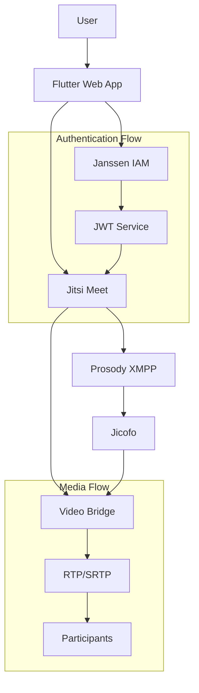
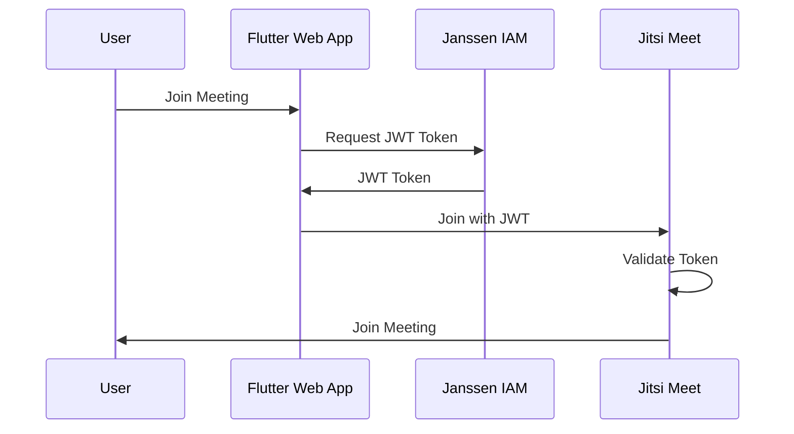

# Jitsi Integration Guide

A comprehensive guide for integrating Janssen IAM with Jitsi Meet video conferencing using the Flutter IAM Admin UI.

## Quick Links
- [Server Configuration Guide](jitsi-server-config.md)
- [Security Configuration Guide](jitsi-security.md)
- [Monitoring & Maintenance Guide](jitsi-monitoring.md)
- [Development Guide](jitsi-development.md)

## Table of Contents
- [Overview](#overview)
- [Prerequisites](#prerequisites)
- [Architecture](#architecture)
- [Basic Setup](#basic-setup)
- [Integration Features](#integration-features)
- [Getting Started](#getting-started)

## Overview

### Integration Features
- Single Sign-On (SSO) via OpenID Connect
- JWT authentication for meetings
- Room access control
- Meeting scheduling
- Recording management
- User authentication
- Lobby management
- Custom branding

### Security Features
- End-to-end encryption
- Meeting password protection
- Waiting room/lobby
- Host controls
- Domain verification
- JWT token security
- IP restriction options

## Prerequisites

### Jitsi Requirements
- Jitsi Meet server
- Prosody XMPP server
- Valid SSL certificates
- Proper DNS configuration
- Jicofo and Jitsi Videobridge

### Janssen Requirements
- Janssen Server 1.1.1+
- OAuth2/OpenID Connect configured
- JWT signing capability
- Admin credentials

### System Requirements
- Prosody modules:
  - mod_auth_token
  - mod_presence_account
  - mod_smacks
  - mod_pubsub
- Nginx/Apache web server
- Valid SSL certificates
- Required ports:
  - 443 (HTTPS)
  - 10000 (Video Bridge)
  - 4443 (JVB Harvester)

## Architecture

### High-Level Integration Flow


### Authentication Flow


## Basic Setup

### 1. Installation Overview
1. Install Jitsi Meet server components
2. Configure Janssen IAM integration
3. Set up JWT authentication
4. Configure room management
5. Implement monitoring

### 2. Initial Configuration Steps
1. DNS Configuration
2. SSL Certificate Setup
3. Firewall Configuration
4. Basic Jitsi Meet Setup
5. Janssen OAuth2 Client Creation

### 3. Integration Verification
1. Token Generation Test
2. Authentication Flow Test
3. Room Creation Test
4. Recording Test
5. Security Verification

## Integration Features

### 1. Authentication & Authorization
- SSO via OpenID Connect
- JWT token-based access
- Role-based permissions
- User session management

### 2. Room Management
- Dynamic room creation
- Access control lists
- Room configuration templates
- Recording management

### 3. User Management
- User provisioning
- Role assignment
- Permission management
- Profile synchronization

### 4. Security Features
- End-to-end encryption
- Meeting access control
- Domain restrictions
- IP filtering

## Getting Started

### 1. Basic Integration
```dart
// Initialize Jitsi integration
final jitsiService = JitsiIntegrationService(
  httpService: httpService,
  jwtService: jwtService,
  configService: configService,
);

// Configure integration
await jitsiService.initialize(
  domain: 'meet.your.domain',
  options: JitsiOptions(
    enableJWT: true,
    enableLobby: true,
    enableE2EE: true,
  ),
);
```

### 2. Create Meeting
```dart
final meeting = await jitsiService.createMeeting(
  name: 'Team Meeting',
  hostId: hostUserId,
  participants: ['user1', 'user2'],
  options: MeetingOptions(
    enableRecording: true,
    requirePassword: true,
    enableLobby: true,
  ),
);
```

### 3. Join Meeting
```dart
final joinUrl = await jitsiService.generateJoinUrl(
  meetingId: meeting.id,
  userId: currentUserId,
  isModerator: false,
);

launchMeeting(joinUrl);
```

## Next Steps
1. Review [Server Configuration Guide](jitsi-server-config.md)
2. Implement [Security Configuration](jitsi-security.md)
3. Set up [Monitoring](jitsi-monitoring.md)
4. Follow [Development Guide](jitsi-development.md)

## Additional Resources
- [Jitsi Meet Documentation](https://jitsi.github.io/handbook/)
- [Janssen OAuth2 Guide](oauth2-configuration.md)
- [JWT Configuration Guide](jwt-configuration.md)
- [API Documentation](api.md)
