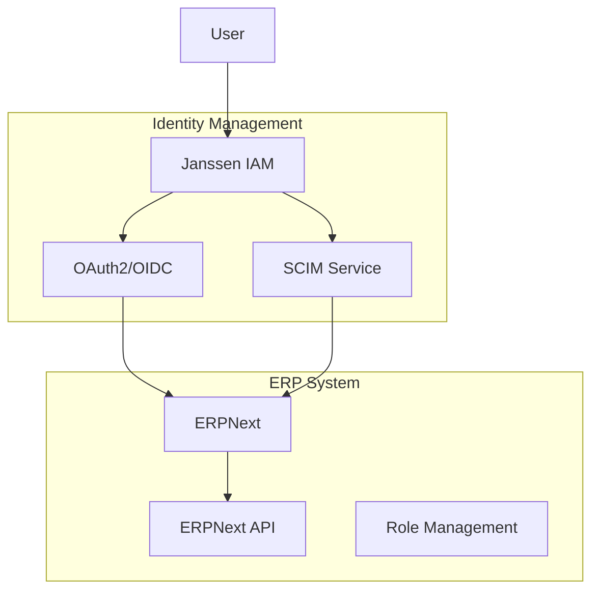

# ERPNext Integration Guide

This guide details the integration between Janssen IAM and ERPNext, providing centralized authentication, user provisioning, and role management.

## Table of Contents
- [Overview](#overview)
- [Prerequisites](#prerequisites)
- [Architecture](#architecture)
- [Janssen Configuration](#janssen-configuration)
- [ERPNext Configuration](#erpnext-configuration)
- [Integration Implementation](#integration-implementation)
- [User Management](#user-management)
- [Role Synchronization](#role-synchronization)
- [Security Considerations](#security-considerations)
- [Troubleshooting](#troubleshooting)

## Overview

### Integration Features
- Single Sign-On (SSO) via OAuth2/OpenID Connect
- Automated user provisioning
- Role synchronization
- Permission mapping
- Profile synchronization
- Audit logging
- API integration

### Architecture


## Prerequisites

### ERPNext Requirements
- ERPNext 14.0+
- Frappe Framework 14.0+
- OAuth2 Client enabled
- REST API enabled
- Administrator access

### Janssen Requirements
- Janssen Server 1.1.1+
- OAuth2/OpenID Connect configured
- SCIM service enabled
- Admin credentials

### Network Requirements
- HTTPS enabled
- Valid SSL certificates
- Proper DNS configuration
- API endpoints accessible

## Janssen Configuration

### 1. OAuth2 Client Setup
```json
{
  "client_name": "erpnext_oauth2",
  "client_id": "${generated_client_id}",
  "client_secret": "${generated_client_secret}",
  "token_endpoint_auth_method": "client_secret_post",
  "application_type": "web",
  "grant_types": [
    "authorization_code",
    "refresh_token"
  ],
  "response_types": ["code"],
  "scope": [
    "openid",
    "profile",
    "email",
    "roles",
    "erpnext"
  ],
  "redirect_uris": [
    "https://your.erpnext.domain/api/method/frappe.integrations.oauth2_logins"
  ]
}
```

### 2. SCIM Configuration
```json
{
  "schemas": ["urn:ietf:params:scim:schemas:core:2.0:ServiceProviderConfig"],
  "documentationUri": "https://your.erpnext.domain/scim/docs",
  "patch": {
    "supported": true
  },
  "bulk": {
    "supported": true,
    "maxOperations": 1000
  },
  "filter": {
    "supported": true,
    "maxResults": 200
  }
}
```

### 3. Role Mapping
```json
{
  "role_mappings": {
    "System Manager": ["erpnext_admin"],
    "HR Manager": ["hr_manager"],
    "Accounts Manager": ["accounts_manager"],
    "Sales Manager": ["sales_manager"],
    "Purchase Manager": ["purchase_manager"],
    "Stock Manager": ["inventory_manager"]
  }
}
```

## ERPNext Configuration

### 1. OAuth2 Provider Setup
```python
# oauth_provider.py
frappe.get_doc({
    "doctype": "OAuth Provider",
    "name": "Janssen IAM",
    "client_id": "${client_id_from_janssen}",
    "client_secret": "${client_secret_from_janssen}",
    "authorize_url": "https://your.janssen.domain/oauth/authorize",
    "token_url": "https://your.janssen.domain/oauth/token",
    "userinfo_url": "https://your.janssen.domain/oauth/userinfo",
    "scopes": ["openid", "profile", "email", "roles"]
}).insert()
```

### 2. User Field Mapping
```python
# user_field_mapping.py
user_field_mapping = {
    'email': 'email',
    'first_name': 'given_name',
    'last_name': 'family_name',
    'mobile_no': 'phone_number',
    'user_type': 'user_type',
    'roles': 'roles'
}
```

### 3. API Configuration
```python
# api_config.py
frappe.get_doc({
    "doctype": "API Configuration",
    "api_key": "${generated_api_key}",
    "api_secret": "${generated_api_secret}",
    "enable_oauth": 1,
    "oauth_provider": "Janssen IAM"
}).insert()
```

## Integration Implementation

### 1. ERPNext Integration Service
```dart
/// ERPNext integration service implementation
class ERPNextIntegrationService implements ServiceIntegration {
  final HttpService _httpService;
  final TokenService _tokenService;
  final ConfigService _configService;

  Future<void> initialize() async {
    final config = await _loadConfiguration();
    await _validateConfig(config);
    await _setupOAuth(config);
  }

  Future<bool> testConnection() async {
    try {
      final response = await _httpService.get(
        '/api/method/frappe.auth.get_logged_user',
      );
      return response.statusCode == 200;
    } catch (e) {
      return false;
    }
  }

  Future<void> provisionUser(User user) async {
    final erpUser = await _createERPUser(user);
    await _assignRoles(erpUser, user.roles);
    await _setupUserPermissions(erpUser);
  }
}
```

### 2. Role Management
```dart
/// Role management implementation
class RoleManagementService {
  final ERPNextIntegrationService _erpService;
  final RoleMappingService _roleMapper;

  Future<void> syncRoles(User user) async {
    // Get mapped ERP roles
    final erpRoles = await _roleMapper.mapRoles(user.roles);
    
    // Update user roles
    await _erpService.updateUserRoles(
      userId: user.id,
      roles: erpRoles,
    );
  }

  Future<void> assignRole(
    String userId,
    String role,
  ) async {
    final erpRole = await _roleMapper.mapRole(role);
    await _erpService.assignRole(userId, erpRole);
  }
}
```

## User Management

### 1. User Provisioning
```dart
/// User provisioning implementation
class UserProvisioningService {
  final ERPNextIntegrationService _erpService;
  final UserMappingService _userMapper;

  Future<void> provisionUser(User user) async {
    try {
      // Map user attributes
      final erpUser = await _userMapper.mapUser(user);
      
      // Create or update user
      final existingUser = await _erpService.findUser(user.email);
      if (existingUser != null) {
        await _updateErpUser(existingUser, erpUser);
      } else {
        await _createErpUser(erpUser);
      }
      
      // Sync roles
      await _syncUserRoles(user);
      
    } catch (e) {
      throw ProvisioningException(
        'Failed to provision user: ${e.toString()}'
      );
    }
  }

  Future<void> deprovisionUser(String userId) async {
    await _erpService.deactivateUser(userId);
    await _cleanupUserData(userId);
  }
}
```

### 2. Profile Synchronization
```dart
/// Profile sync implementation
class ProfileSyncService {
  final ERPNextIntegrationService _erpService;
  final UserMappingService _userMapper;

  Future<void> syncUserProfile(String userId) async {
    final jansUser = await _userService.getUser(userId);
    final erpUser = await _erpService.getUser(userId);

    if (_needsUpdate(jansUser, erpUser)) {
      final updatedProfile = await _userMapper.mapProfile(
        jansUser
      );
      
      await _erpService.updateUserProfile(
        userId: userId,
        profile: updatedProfile,
      );
    }
  }
}
```

## Role Synchronization

### 1. Role Mapping Service
```dart
/// Role mapping service implementation
class RoleMappingService {
  final Map<String, List<String>> _roleMap;

  Future<List<String>> mapRoles(List<String> jansRoles) async {
    final erpRoles = <String>[];
    
    for (final role in jansRoles) {
      final mappedRoles = _roleMap[role] ?? [];
      erpRoles.addAll(mappedRoles);
    }
    
    return erpRoles;
  }

  Future<void> updateRoleMapping(
    String jansRole,
    List<String> erpRoles,
  ) async {
    _roleMap[jansRole] = erpRoles;
    await _saveRoleMap();
  }
}
```

### 2. Permission Management
```dart
/// Permission management implementation
class PermissionManager {
  Future<void> setupUserPermissions(
    String userId,
    List<String> roles,
  ) async {
    final permissions = await _getPermissionsForRoles(roles);
    
    for (final permission in permissions) {
      await _erpService.grantPermission(
        userId: userId,
        permission: permission,
      );
    }
  }

  Future<void> revokePermissions(
    String userId,
    List<String> permissions,
  ) async {
    for (final permission in permissions) {
      await _erpService.revokePermission(
        userId: userId,
        permission: permission,
      );
    }
  }
}
```

## Security Considerations

### 1. Token Security
```dart
/// Token security implementation
class TokenSecurityService {
  Future<void> validateToken(String token) async {
    final parts = token.split('.');
    if (parts.length != 3) {
      throw SecurityException('Invalid token format');
    }

    final header = _decodeBase64(parts[0]);
    final payload = _decodeBase64(parts[1]);
    
    await _validateSignature(token);
    _validateExpiry(payload);
    _validateIssuer(payload);
    _validateAudience(payload);
  }
}
```

### 2. API Security
```dart
/// API security implementation
class ApiSecurityService {
  Future<void> secureRequest(http.Request request) async {
    // Add API authentication
    final apiKey = await _getApiKey();
    final apiSecret = await _getApiSecret();
    
    request.headers['X-Api-Key'] = apiKey;
    request.headers['X-Api-Secret'] = apiSecret;
    
    // Add OAuth token
    final token = await _tokenService.getToken();
    request.headers['Authorization'] = 'Bearer $token';
    
    // Add additional security headers
    request.headers['X-Frame-Options'] = 'DENY';
    request.headers['X-Content-Type-Options'] = 'nosniff';
    request.headers['X-XSS-Protection'] = '1; mode=block';
  }
}
```

## Troubleshooting

### 1. Integration Diagnostics
```dart
/// Diagnostic tool implementation
class IntegrationDiagnostics {
  Future<DiagnosticReport> runDiagnostics() async {
    final report = DiagnosticReport();
    
    try {
      // Check OAuth configuration
      report.addResult(await _checkOAuth());
      
      // Verify API connectivity
      report.addResult(await _checkApi());
      
      // Test user provisioning
      report.addResult(await _testProvisioning());
      
      // Validate role sync
      report.addResult(await _checkRoleSync());
      
    } catch (e) {
      report.addError(e.toString());
    }
    
    return report;
  }
}
```

### 2. Error Recovery
```dart
/// Error recovery implementation
class ErrorRecovery {
  Future<void> attemptRecovery(
    IntegrationError error,
  ) async {
    switch (error.type) {
      case ErrorType.tokenExpired:
        await _refreshToken();
        break;
      case ErrorType.connectionLost:
        await _reconnect();
        break;
      case ErrorType.syncFailed:
        await _retrySync();
        break;
      default:
        await _logError(error);
        throw UnrecoverableError(error);
    }
  }
}
```

## Additional Resources
- [ERPNext API Documentation](https://frappeframework.com/docs/v14/user/en/api)
- [Janssen OAuth2 Guide](oauth2-configuration.md)
- [SCIM Integration Guide](scim-integration.md)
- [Security Best Practices](security.md)
