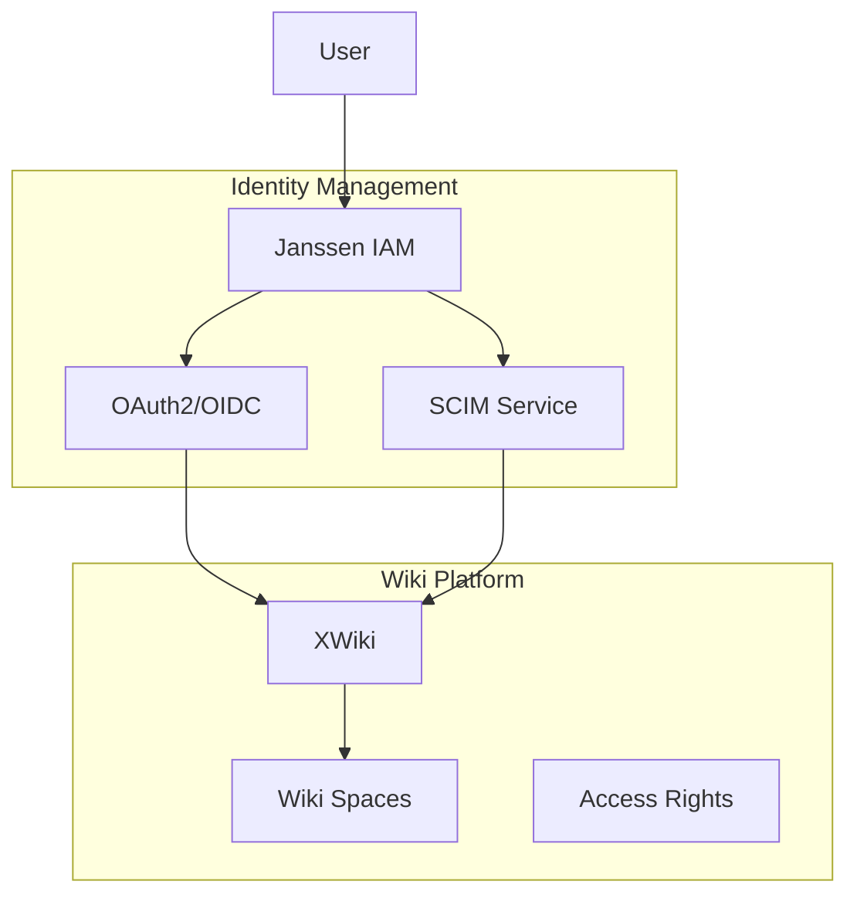

# XWiki Integration Guide

A guide for integrating Janssen IAM with XWiki, providing centralized authentication, user management, and access control.

## Table of Contents
- [Overview](#overview)
- [Prerequisites](#prerequisites)
- [Configuration](#configuration)
- [Integration Implementation](#integration-implementation)
- [Access Control](#access-control)
- [Security Considerations](#security-considerations)
- [API Integration](#api-integration)
- [Troubleshooting](#troubleshooting)

## Overview

### Integration Features
- Single Sign-On (SSO) via OAuth2/OpenID Connect
- Automated user provisioning
- Role/group synchronization
- Wiki space access control
- Document-level permissions
- User profile synchronization
- API integration
- Audit logging

### Architecture


## Prerequisites
- XWiki Enterprise 13.10+
- Janssen Server 1.1.1+
- OAuth2/OpenID Connect module installed
- Valid SSL certificates
- Administrator access
- API access enabled

## Configuration

### 1. Janssen OAuth2 Setup
```json
{
  "client_name": "xwiki_oauth2",
  "client_id": "${generated_client_id}",
  "client_secret": "${generated_client_secret}",
  "application_type": "web",
  "grant_types": ["authorization_code", "refresh_token"],
  "scope": ["openid", "profile", "email", "roles"],
  "redirect_uris": ["https://your.xwiki.domain/oidc/callback"]
}
```

### 2. XWiki Configuration
```properties
# xwiki.cfg
xwiki.authentication.authclass=org.xwiki.contrib.oidc.auth.OIDCAuthenticator
xwiki.authentication.trustauth=true

# oidc.properties
oidc.endpoint=https://your.janssen.domain
oidc.clientId=${client_id_from_janssen}
oidc.clientSecret=${client_secret_from_janssen}
oidc.userInfoMapping.login=preferred_username
oidc.userInfoMapping.name=name
oidc.userInfoMapping.email=email
oidc.userInfoMapping.groups=xwiki_groups
```

### 3. Role Mapping
```json
{
  "role_mappings": {
    "admin": ["XWikiAdminGroup"],
    "editor": ["XWikiEditorGroup"],
    "viewer": ["XWikiViewerGroup"]
  }
}
```

## Integration Implementation

### Core Service
```dart
class XWikiService {
  final HttpService _httpService;
  final TokenService _tokenService;

  Future<void> createSpace(String spaceName, SpaceConfig config) async {
    final token = await _tokenService.getToken();
    await _httpService.post(
      '/rest/wikis/xwiki/spaces',
      headers: {'Authorization': 'Bearer $token'},
      body: {
        'name': spaceName,
        'description': config.description,
        'permissions': config.permissions
      },
    );
  }

  Future<void> updateUserAccess(String userId, List<String> spaces) async {
    final token = await _tokenService.getToken();
    await _httpService.put(
      '/rest/wikis/xwiki/users/$userId/spaces',
      headers: {'Authorization': 'Bearer $token'},
      body: {'spaces': spaces},
    );
  }
}
```

### User Provisioning
```dart
class XWikiUserManager {
  Future<void> provisionUser(User user) async {
    // Map Janssen roles to XWiki groups
    final groups = await _mapRoles(user.roles);
    
    await _xwikiService.createUser({
      'userId': user.id,
      'firstName': user.firstName,
      'lastName': user.lastName,
      'email': user.email,
      'groups': groups
    });
  }

  Future<void> syncUserProfile(String userId) async {
    final jansUser = await _userService.getUser(userId);
    final xwikiUser = await _xwikiService.getUser(userId);

    if (_needsUpdate(jansUser, xwikiUser)) {
      await _updateXWikiUser(userId, jansUser);
    }
  }
}
```

## Access Control

### Permission Management
```dart
class XWikiAccessControl {
  Future<void> setSpacePermissions(
    String space,
    Map<String, List<String>> permissions
  ) async {
    await _xwikiService.updateSpaceRights(
      space,
      permissions,
    );
  }

  Future<void> setDocumentPermissions(
    String document,
    Map<String, List<String>> permissions
  ) async {
    await _xwikiService.updateDocumentRights(
      document,
      permissions,
    );
  }
}
```

### Group Synchronization
```dart
class GroupSync {
  Future<void> syncGroups(List<String> jansRoles) async {
    final mappedGroups = await _roleMapper.mapToXWikiGroups(jansRoles);
    
    for (final group in mappedGroups) {
      await _ensureGroupExists(group);
    }
  }
}
```

## Security Considerations
- Enable SSL/TLS
- Configure secure headers
- Implement token validation
- Set up audit logging
- Regular permission review
- Group membership validation
- Document access monitoring

## API Integration

### Basic Usage
```dart
final xwikiService = XWikiService(httpService, tokenService);

// Create new space
await xwikiService.createSpace(
  'ProjectDocs',
  SpaceConfig(
    description: 'Project Documentation',
    permissions: {
      'XWikiAdminGroup': ['admin', 'edit', 'view'],
      'XWikiEditorGroup': ['edit', 'view'],
      'XWikiViewerGroup': ['view']
    }
  )
);

// Update user access
await xwikiService.updateUserAccess(
  userId,
  ['ProjectDocs', 'TeamDocs']
);
```

### Event Handling
```dart
xwikiService.events.listen((event) {
  switch (event.type) {
    case 'user_access_changed':
      _handleAccessChange(event);
      break;
    case 'space_created':
      _handleSpaceCreation(event);
      break;
  }
});
```

## Troubleshooting

### Common Issues
1. Authentication failures
2. Group synchronization issues
3. Permission inheritance problems
4. API access errors

### Debugging
```dart
// Enable debug mode
XWikiService.enableDebug();

// Monitor API requests
xwikiService.onRequest.listen((request) {
  print('API Request: ${request.method} ${request.url}');
});
```

## Additional Resources
- [XWiki Documentation](https://www.xwiki.org/xwiki/bin/view/Documentation/)
- [OAuth/OpenID Connect Configuration](https://extensions.xwiki.org/xwiki/bin/view/Extension/OpenID%20Connect%20Authentication/)
- [REST API Documentation](https://www.xwiki.org/xwiki/bin/view/Documentation/UserGuide/Features/XWikiRESTfulAPI/)
- [Security Best Practices](security.md)
