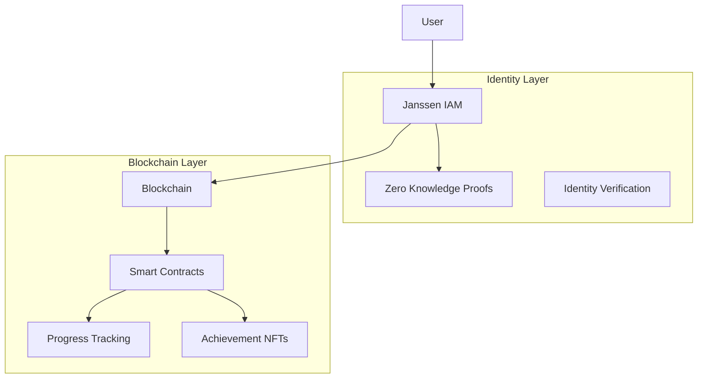

# Blockchain Integration Guide - Privacy-Preserving Identity Management

A guide for integrating blockchain-based identity management with Janssen IAM, focusing on privacy-preserving progress tracking for educational environments.

## Overview

### Core Features
- Anonymous identity verification
- Private progress tracking
- Achievement NFTs
- Zero-knowledge proofs
- Smart contract automation
- GDPR/COPPA compliance
- Revocable anonymity (authorized only)

### Architecture


## Core Components

### 1. Identity Bridge
```dart
/// Privacy-preserving identity bridge implementation
class BlockchainIdentityBridge {
  final Web3Service _web3;
  final ZKProofService _zkp;
  
  /// Generate anonymous identifier for student
  Future<String> createAnonymousId(String janssenId) async {
    // Generate zero-knowledge proof of valid student
    final proof = await _zkp.generateProof(
      statement: 'validStudent',
      attributes: ['age', 'enrollment'],
      privateData: {'janssenId': janssenId},
    );
    
    // Create blockchain identity with proof
    final txn = await _web3.sendTransaction(
      contract: 'IdentityRegistry',
      method: 'registerAnonymousStudent',
      params: [proof.publicInputs, proof.proof],
    );
    
    return txn.anonymousId;
  }

  /// Verify student without revealing identity
  Future<bool> verifyStudent(String anonymousId) async {
    final result = await _web3.call(
      contract: 'IdentityRegistry',
      method: 'verifyStudent',
      params: [anonymousId],
    );
    return result.isValid;
  }
}
```

### 2. Progress Tracking
```dart
/// Private progress tracking implementation
class ProgressTracker {
  final Web3Service _web3;
  final String contractAddress;

  /// Record achievement privately
  Future<void> recordAchievement({
    required String anonymousId,
    required String achievementId,
    required Map<String, dynamic> evidence,
  }) async {
    // Hash evidence data
    final evidenceHash = await _hashEvidence(evidence);
    
    // Record on chain
    await _web3.sendTransaction(
      contract: 'ProgressTracker',
      method: 'recordAchievement',
      params: [anonymousId, achievementId, evidenceHash],
    );
  }

  /// Get progress without revealing identity
  Future<List<Achievement>> getProgress(String anonymousId) async {
    final result = await _web3.call(
      contract: 'ProgressTracker',
      method: 'getAchievements',
      params: [anonymousId],
    );
    return result.achievements;
  }
}
```

### 3. NFT Achievements
```dart
/// Achievement NFT implementation
class AchievementNFT {
  final Web3Service _web3;
  final String nftContract;

  /// Mint achievement NFT privately
  Future<String> mintAchievement({
    required String anonymousId,
    required String achievementId,
    required Map<String, dynamic> metadata,
  }) async {
    // Create private NFT metadata
    final privateMetadata = await _createPrivateMetadata(
      anonymousId,
      metadata,
    );
    
    // Mint NFT
    final txn = await _web3.sendTransaction(
      contract: nftContract,
      method: 'mintAchievement',
      params: [anonymousId, privateMetadata],
    );
    
    return txn.tokenId;
  }
}
```

## Smart Contracts

### 1. Identity Registry
```solidity
// Identity registry with privacy protection
contract IdentityRegistry {
    // Anonymous identity mapping
    mapping(bytes32 => bool) private validStudents;
    
    // Register student with zero-knowledge proof
    function registerAnonymousStudent(
        bytes calldata publicInputs,
        bytes calldata proof
    ) external returns (bytes32 anonymousId) {
        require(
            verifyProof(publicInputs, proof),
            "Invalid proof"
        );
        
        anonymousId = keccak256(abi.encode(publicInputs));
        validStudents[anonymousId] = true;
        
        emit StudentRegistered(anonymousId);
        return anonymousId;
    }
    
    // Verify student without revealing identity
    function verifyStudent(
        bytes32 anonymousId
    ) external view returns (bool) {
        return validStudents[anonymousId];
    }
}
```

### 2. Progress Contract
```solidity
// Private progress tracking contract
contract ProgressTracker {
    // Achievement structure
    struct Achievement {
        bytes32 id;
        bytes32 evidenceHash;
        uint256 timestamp;
    }
    
    // Private progress mapping
    mapping(bytes32 => Achievement[]) private studentAchievements;
    
    // Record achievement
    function recordAchievement(
        bytes32 anonymousId,
        bytes32 achievementId,
        bytes32 evidenceHash
    ) external {
        require(
            IdentityRegistry(idRegistry).verifyStudent(anonymousId),
            "Invalid student"
        );
        
        studentAchievements[anonymousId].push(Achievement({
            id: achievementId,
            evidenceHash: evidenceHash,
            timestamp: block.timestamp
        }));
        
        emit AchievementRecorded(anonymousId, achievementId);
    }
}
```

## Privacy Implementation

### 1. Zero-Knowledge Proofs
```dart
/// ZKP service implementation
class ZKProofService {
  /// Generate proof of valid student
  Future<ZKProof> generateProof({
    required String statement,
    required List<String> attributes,
    required Map<String, dynamic> privateData,
  }) async {
    // Create circuit inputs
    final inputs = await _createCircuitInputs(
      attributes,
      privateData,
    );
    
    // Generate proof
    final proof = await _generateZKProof(
      statement,
      inputs,
    );
    
    return proof;
  }

  /// Verify proof without revealing data
  Future<bool> verifyProof(ZKProof proof) async {
    return await _verifyZKProof(
      proof.statement,
      proof.publicInputs,
      proof.proof,
    );
  }
}
```

### 2. Data Protection
```dart
/// Data protection implementation
class PrivacyProtection {
  /// Encrypt sensitive data
  Future<String> encryptData(
    String data,
    String publicKey,
  ) async {
    final encrypted = await _encrypt(data, publicKey);
    return encrypted;
  }

  /// Decrypt with authorization
  Future<String> decryptData(
    String encrypted,
    String privateKey,
    AuthorizationProof auth,
  ) async {
    require(await _verifyAuthorization(auth));
    return await _decrypt(encrypted, privateKey);
  }
}
```

## Additional Resources
- [Technical Deep Dive](blockchain-technical.md)
- [Privacy Implementation](privacy-implementation.md)
- [Smart Contract Reference](smart-contracts.md)
- [ZKP Implementation](zkp-implementation.md)
