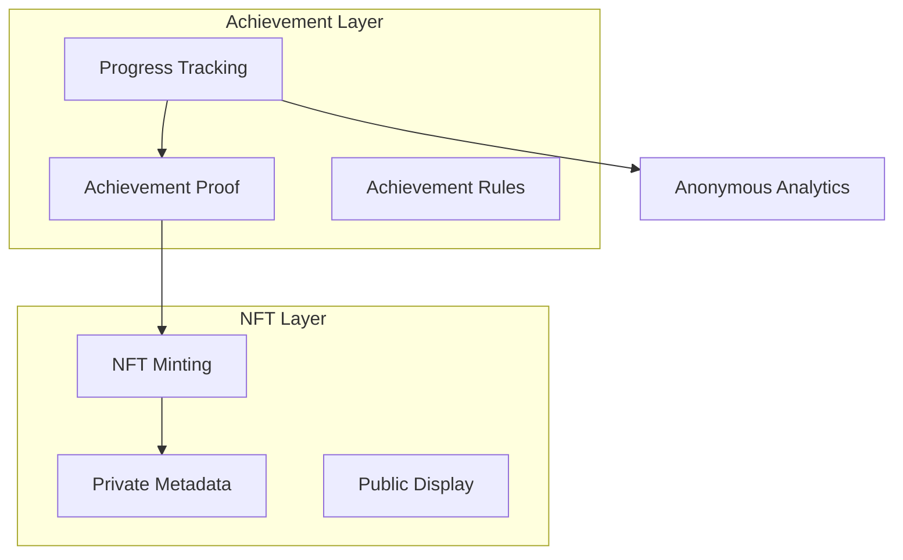

# Blockchain Integration - Achievement & Progress Tracking

Implementation guide for privacy-preserving achievement tracking and NFT management.

## Overview

### Core Features
- Private achievement recording
- Achievement NFT minting
- Progress verification
- Badge system
- Encrypted metadata
- Time-based unlocks
- Composite achievements

### Architecture


## Smart Contracts

### Achievement Contract
```solidity
contract PrivateAchievements {
    struct Achievement {
        bytes32 id;
        bytes32 criteriaHash;
        bytes32 evidenceHash;
        uint256 timestamp;
        bool revocable;
    }
    
    mapping(bytes32 => Achievement[]) private studentAchievements;
    mapping(bytes32 => mapping(bytes32 => bool)) private achievementGranted;
    
    event AchievementUnlocked(bytes32 indexed studentId, bytes32 achievementId);
    
    function unlockAchievement(
        bytes32 studentId,
        bytes32 achievementId,
        bytes calldata proof,
        bytes32 evidenceHash
    ) external {
        require(
            !achievementGranted[studentId][achievementId],
            "Already unlocked"
        );
        
        require(
            verifyAchievementProof(achievementId, proof),
            "Invalid proof"
        );
        
        achievementGranted[studentId][achievementId] = true;
        
        studentAchievements[studentId].push(Achievement({
            id: achievementId,
            criteriaHash: keccak256(proof),
            evidenceHash: evidenceHash,
            timestamp: block.timestamp,
            revocable: false
        }));
        
        emit AchievementUnlocked(studentId, achievementId);
    }
}
```

### NFT Implementation
```solidity
contract AchievementNFT is ERC721, ERC721URIStorage {
    struct Metadata {
        bytes32 achievementId;
        bytes32 studentId;
        bytes encryptedData;
        string publicData;
    }
    
    mapping(uint256 => Metadata) private _tokenMetadata;
    
    function mintAchievement(
        bytes32 studentId,
        bytes32 achievementId,
        bytes memory encryptedData,
        string memory publicData
    ) external returns (uint256) {
        require(
            AchievementRegistry(registry).hasAchievement(
                studentId,
                achievementId
            ),
            "Achievement not earned"
        );
        
        uint256 tokenId = _nextTokenId++;
        _mint(msg.sender, tokenId);
        
        _tokenMetadata[tokenId] = Metadata({
            achievementId: achievementId,
            studentId: studentId,
            encryptedData: encryptedData,
            publicData: publicData
        });
        
        return tokenId;
    }
}
```

## Implementation

### Achievement Service
```dart
class AchievementService {
  final Web3Service _web3;
  final ZKProofService _zkp;

  Future<void> unlockAchievement({
    required String anonymousId,
    required String achievementId,
    required Map<String, dynamic> evidence,
  }) async {
    // Generate proof of completion
    final proof = await _zkp.generateProof(
      statement: 'achievementCompleted',
      privateData: {
        'studentId': anonymousId,
        'evidence': evidence,
      },
    );
    
    // Hash evidence for on-chain storage
    final evidenceHash = await _hashEvidence(evidence);
    
    // Record achievement
    await _web3.sendTransaction(
      contract: 'PrivateAchievements',
      method: 'unlockAchievement',
      params: [
        anonymousId,
        achievementId,
        proof.proof,
        evidenceHash,
      ],
    );
  }

  Future<List<Achievement>> getAchievements(
    String anonymousId,
  ) async {
    final result = await _web3.call(
      contract: 'PrivateAchievements',
      method: 'getStudentAchievements',
      params: [anonymousId],
    );
    
    return _decryptAchievements(result);
  }
}
```

### NFT Management
```dart
class NFTManager {
  final Web3Service _web3;
  final EncryptionService _encryption;

  Future<String> mintAchievementNFT({
    required String anonymousId,
    required String achievementId,
    required Map<String, dynamic> privateData,
    required Map<String, dynamic> publicData,
  }) async {
    // Encrypt private metadata
    final encrypted = await _encryption.encrypt(
      privateData,
      _encryption.publicKey,
    );
    
    // Create public metadata
    final public = await _createPublicMetadata(publicData);
    
    // Mint NFT
    final result = await _web3.sendTransaction(
      contract: 'AchievementNFT',
      method: 'mintAchievement',
      params: [
        anonymousId,
        achievementId,
        encrypted,
        public,
      ],
    );
    
    return result.tokenId;
  }
}
```

### Progress Tracking
```dart
class ProgressTracker {
  Future<ProgressReport> getProgress(String anonymousId) async {
    final achievements = await _achievementService.getAchievements(
      anonymousId,
    );
    
    final categories = await _categorizeAchievements(
      achievements,
    );
    
    return ProgressReport(
      totalAchievements: achievements.length,
      categorizedProgress: categories,
      nextMilestones: await _calculateNextMilestones(
        anonymousId,
        categories,
      ),
    );
  }
}
```

## Privacy Features

### Metadata Protection
```dart
class MetadataProtection {
  /// Split metadata into public/private components
  Future<SplitMetadata> splitMetadata(
    Map<String, dynamic> metadata,
  ) async {
    final public = {
      'name': metadata['name'],
      'image': metadata['image'],
      'description': metadata['description'],
    };
    
    final private = {
      'studentDetails': metadata['studentDetails'],
      'completionDate': metadata['completionDate'],
      'assessmentDetails': metadata['assessmentDetails'],
    };
    
    return SplitMetadata(
      public: public,
      private: await _encryption.encrypt(private),
    );
  }
}
```

### Achievement Rules
```dart
class AchievementRules {
  Future<bool> verifyCompletion({
    required String anonymousId,
    required String achievementId,
    required Map<String, dynamic> evidence,
  }) async {
    final rules = await _loadAchievementRules(achievementId);
    
    // Verify prerequisites
    if (!await _checkPrerequisites(anonymousId, rules.prerequisites)) {
      return false;
    }
    
    // Verify completion criteria
    return await _verifyEvidence(
      evidence,
      rules.criteria,
    );
  }
}
```

## Usage Examples

### Recording Achievement
```dart
// Initialize services
final achievementService = AchievementService(web3, zkp);
final nftManager = NFTManager(web3, encryption);

// Record achievement
await achievementService.unlockAchievement(
  anonymousId: studentId,
  achievementId: 'course_completion_101',
  evidence: {
    'completionDate': DateTime.now(),
    'assessmentScore': 95,
    'validatorSignature': signature,
  },
);

// Mint achievement NFT
final tokenId = await nftManager.mintAchievementNFT(
  anonymousId: studentId,
  achievementId: 'course_completion_101',
  privateData: {
    'studentDetails': encryptedDetails,
    'assessmentDetails': encryptedAssessment,
  },
  publicData: {
    'name': 'Course 101 Completion',
    'description': 'Successfully completed Course 101',
    'image': 'ipfs://achievement-image-hash',
  },
);
```

### Checking Progress
```dart
final progress = await progressTracker.getProgress(studentId);

print('Total Achievements: ${progress.totalAchievements}');
for (final category in progress.categorizedProgress.entries) {
  print('${category.key}: ${category.value.completionPercentage}%');
}
```

## Additional Resources
- [NFT Standards](nft-standards.md)
- [Achievement Design](achievement-design.md)
- [Privacy Implementation](privacy-impl.md)
- [Smart Contract Reference](smart-contracts.md)
