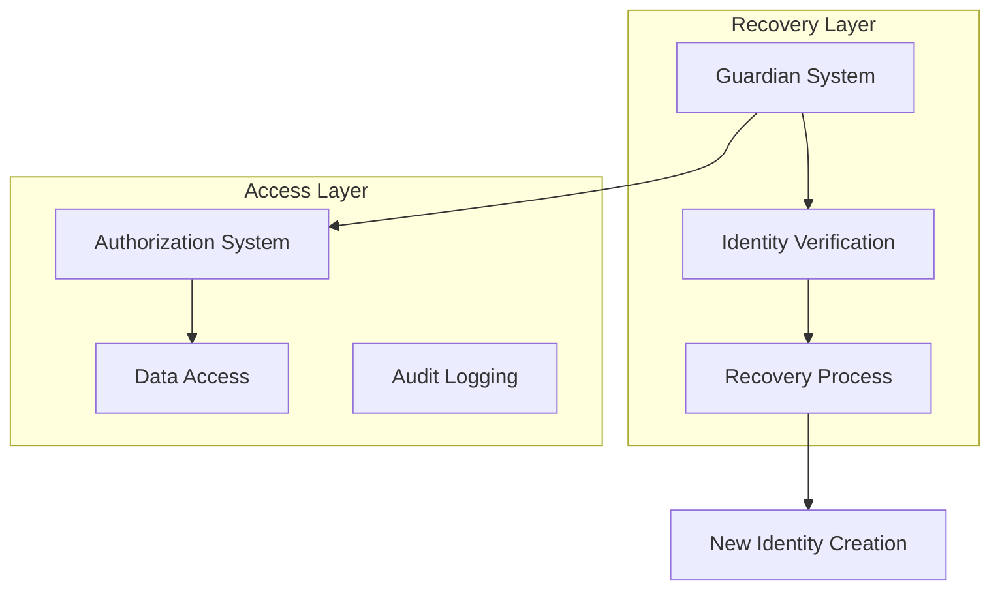

# Blockchain Integration - Authorization & Recovery Systems

Implementation guide for secure identity recovery and authorized access systems in privacy-preserving educational tracking.

## Overview

### Core Features
- Secure identity recovery
- Authorized data access
- Guardian system
- Emergency access
- Legal compliance
- Revocation mechanisms
- Audit trails

### Architecture


## Smart Contracts

### Guardian Management
```solidity
contract GuardianSystem {
    struct Guardian {
        bytes32 guardianHash;
        uint256 appointedTime;
        bool active;
    }
    
    // Student to guardians mapping
    mapping(bytes32 => Guardian[]) private studentGuardians;
    
    // Recovery threshold
    uint256 public constant REQUIRED_GUARDIANS = 2;
    
    event GuardianAdded(bytes32 indexed studentId, bytes32 guardianHash);
    event RecoveryInitiated(bytes32 indexed studentId);
    
    function addGuardian(
        bytes32 studentId,
        bytes32 guardianHash
    ) external {
        require(
            isAuthorizedStudent(studentId),
            "Unauthorized"
        );
        
        studentGuardians[studentId].push(Guardian({
            guardianHash: guardianHash,
            appointedTime: block.timestamp,
            active: true
        }));
        
        emit GuardianAdded(studentId, guardianHash);
    }
    
    function initiateRecovery(
        bytes32 studentId,
        bytes32[] calldata guardianProofs
    ) external {
        require(
            validateGuardianProofs(studentId, guardianProofs),
            "Invalid guardian proofs"
        );
        
        emit RecoveryInitiated(studentId);
    }
}
```

### Authorization Control
```solidity
contract AuthorizationControl {
    struct Authorization {
        bytes32 granterId;
        bytes32 granteeId;
        bytes32 dataHash;
        uint256 expiryTime;
        bool revoked;
    }
    
    mapping(bytes32 => Authorization[]) private authorizations;
    
    event AccessGranted(
        bytes32 indexed granterId,
        bytes32 indexed granteeId,
        bytes32 dataHash
    );
    
    function grantAccess(
        bytes32 granteeId,
        bytes32 dataHash,
        uint256 duration
    ) external {
        bytes32 granterId = msg.sender;
        uint256 expiry = block.timestamp + duration;
        
        authorizations[granterId].push(Authorization({
            granterId: granterId,
            granteeId: granteeId,
            dataHash: dataHash,
            expiryTime: expiry,
            revoked: false
        }));
        
        emit AccessGranted(granterId, granteeId, dataHash);
    }
    
    function checkAccess(
        bytes32 granteeId,
        bytes32 dataHash
    ) external view returns (bool) {
        bytes32 granterId = msg.sender;
        return _hasValidAuthorization(
            granterId,
            granteeId,
            dataHash
        );
    }
}
```

## Implementation

### Guardian Service
```dart
class GuardianService {
  final Web3Service _web3;
  final ZKProofService _zkp;

  Future<void> addGuardian({
    required String studentId,
    required String guardianId,
    required GuardianType type,
  }) async {
    // Generate guardian hash
    final guardianHash = await _generateGuardianHash(
      guardianId,
      type,
    );
    
    // Add guardian to contract
    await _web3.sendTransaction(
      contract: 'GuardianSystem',
      method: 'addGuardian',
      params: [studentId, guardianHash],
    );
  }

  Future<bool> initiateRecovery({
    required String studentId,
    required List<GuardianProof> proofs,
  }) async {
    try {
      // Validate guardian proofs
      final validProofs = await Future.wait(
        proofs.map((p) => _validateGuardianProof(p)),
      );
      
      if (validProofs.every((v) => v)) {
        // Initiate recovery process
        await _web3.sendTransaction(
          contract: 'GuardianSystem',
          method: 'initiateRecovery',
          params: [studentId, proofs.map((p) => p.hash).toList()],
        );
        return true;
      }
      
      return false;
    } catch (e) {
      throw RecoveryException('Recovery failed: ${e.toString()}');
    }
  }
}
```

### Authorization Service
```dart
class AuthorizationService {
  final EncryptionService _encryption;
  final Web3Service _web3;

  Future<void> grantAccess({
    required String granteeId,
    required String dataHash,
    required Duration duration,
  }) async {
    // Create authorization
    await _web3.sendTransaction(
      contract: 'AuthorizationControl',
      method: 'grantAccess',
      params: [
        granteeId,
        dataHash,
        duration.inSeconds,
      ],
    );
  }

  Future<bool> checkAccess({
    required String granteeId,
    required String dataHash,
  }) async {
    return await _web3.call(
      contract: 'AuthorizationControl',
      method: 'checkAccess',
      params: [granteeId, dataHash],
    );
  }

  Future<String> decryptAuthorizedData({
    required String encryptedData,
    required String granteeId,
  }) async {
    if (await checkAccess(
      granteeId: granteeId,
      dataHash: _hashData(encryptedData),
    )) {
      return await _encryption.decrypt(encryptedData);
    }
    
    throw UnauthorizedAccessException();
  }
}
```

### Recovery Process
```dart
class RecoveryProcess {
  final GuardianService _guardianService;
  final IdentityService _identityService;

  Future<String> recoverIdentity({
    required String oldId,
    required List<GuardianProof> proofs,
  }) async {
    // Initiate recovery
    final recoverySuccess = await _guardianService.initiateRecovery(
      studentId: oldId,
      proofs: proofs,
    );
    
    if (recoverySuccess) {
      // Create new identity
      final newId = await _identityService.createNewIdentity();
      
      // Link identities securely
      await _linkIdentities(oldId, newId);
      
      // Transfer achievements and progress
      await _transferProgress(oldId, newId);
      
      return newId;
    }
    
    throw RecoveryException('Recovery validation failed');
  }

  Future<void> _transferProgress(
    String oldId,
    String newId,
  ) async {
    // Transfer achievements
    await _transferAchievements(oldId, newId);
    
    // Transfer NFTs
    await _transferNFTs(oldId, newId);
    
    // Update progress records
    await _updateProgressRecords(oldId, newId);
  }
}
```

### Emergency Access
```dart
class EmergencyAccess {
  final AuthorizationService _authService;
  final GuardianService _guardianService;

  Future<void> grantEmergencyAccess({
    required String studentId,
    required String guardianId,
    required EmergencyReason reason,
  }) async {
    // Verify guardian status
    if (await _guardianService.isActiveGuardian(
      studentId: studentId,
      guardianId: guardianId,
    )) {
      // Create time-limited authorization
      await _authService.grantAccess(
        granteeId: guardianId,
        dataHash: await _getStudentDataHash(studentId),
        duration: Duration(hours: 24),
      );
      
      // Log emergency access
      await _logEmergencyAccess(
        studentId: studentId,
        guardianId: guardianId,
        reason: reason,
      );
    }
  }
}
```

## Legal Compliance

### GDPR Implementation
```dart
class GDPRCompliance {
  Future<void> handleDataRequest({
    required String studentId,
    required GDPRRequestType type,
  }) async {
    switch (type) {
      case GDPRRequestType.access:
        await _provideDataAccess(studentId);
        break;
      case GDPRRequestType.deletion:
        await _handleDeletion(studentId);
        break;
      case GDPRRequestType.portability:
        await _exportData(studentId);
        break;
    }
  }

  Future<void> _handleDeletion(String studentId) async {
    // Mark for deletion
    await _markForDeletion(studentId);
    
    // Revoke access
    await _revokeAllAccess(studentId);
    
    // Log deletion request
    await _logDeletionRequest(studentId);
  }
}
```

### Audit System
```dart
class AuditSystem {
  Future<void> logAccess({
    required String studentId,
    required String accessorId,
    required AccessType type,
  }) async {
    final event = AuditEvent(
      studentId: studentId,
      accessorId: accessorId,
      type: type,
      timestamp: DateTime.now(),
    );
    
    await _storeAuditEvent(event);
    
    if (_isSignificantEvent(type)) {
      await _notifyGuardians(studentId, event);
    }
  }

  Future<List<AuditEvent>> getAuditTrail(
    String studentId,
  ) async {
    return await _loadAuditEvents(studentId);
  }
}
```

## Usage Examples

### Setting Up Recovery
```dart
// Add guardians
await guardianService.addGuardian(
  studentId: studentId,
  guardianId: parentId,
  type: GuardianType.parent,
);

await guardianService.addGuardian(
  studentId: studentId,
  guardianId: schoolId,
  type: GuardianType.institution,
);

// Recover identity
final newId = await recoveryProcess.recoverIdentity(
  oldId: lostStudentId,
  proofs: [parentProof, schoolProof],
);
```

### Managing Access
```dart
// Grant temporary access
await authorizationService.grantAccess(
  granteeId: teacherId,
  dataHash: progressHash,
  duration: Duration(days: 30),
);

// Check and decrypt data
if (await authorizationService.checkAccess(
  granteeId: teacherId,
  dataHash: progressHash,
)) {
  final data = await authorizationService.decryptAuthorizedData(
    encryptedData: encryptedProgress,
    granteeId: teacherId,
  );
}
```

## Additional Resources
- [Recovery Mechanisms](recovery-mechanisms.md)
- [Authorization Flows](authorization-flows.md)
- [Guardian System](guardian-system.md)
- [Compliance Guide](compliance-guide.md)
