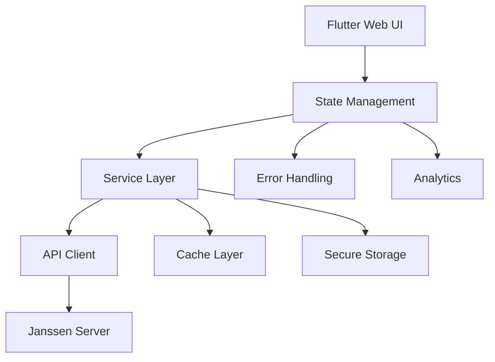
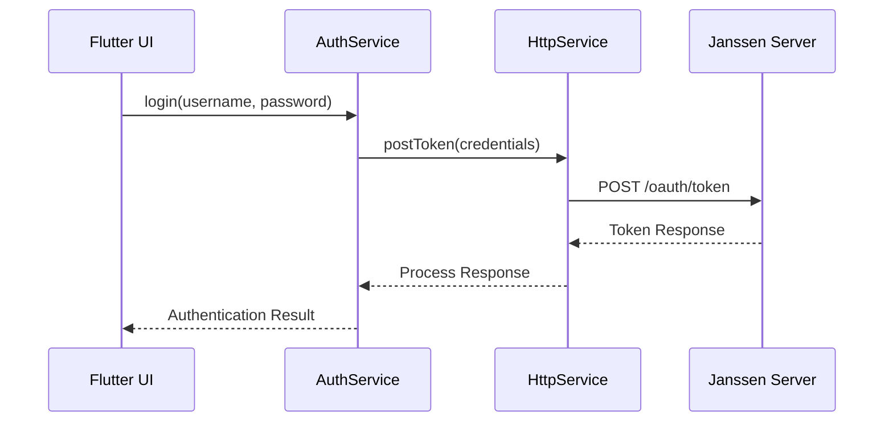
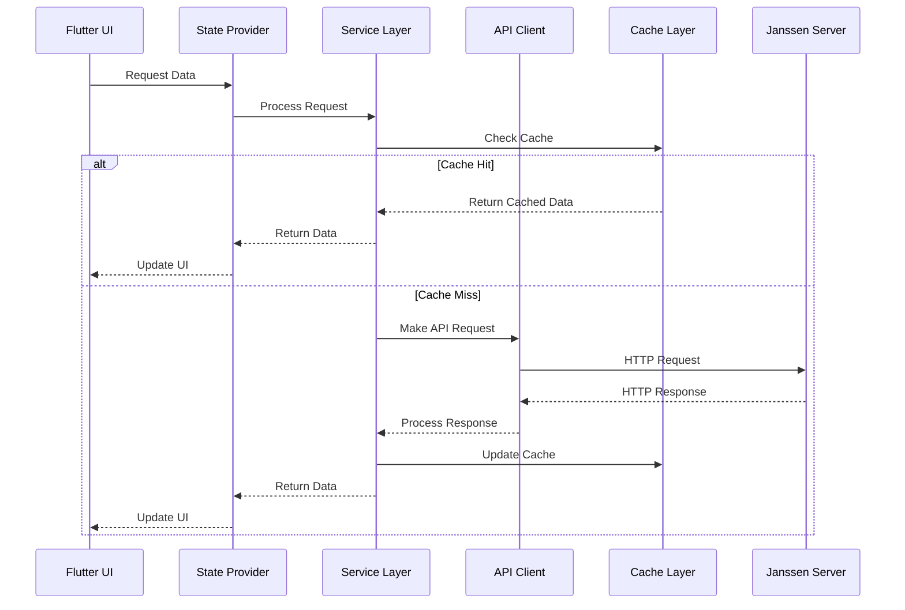
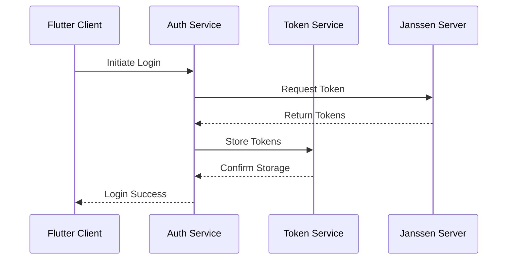

# Architecture Overview

This document details the technical architecture of the Flutter IAM Admin UI for Janssen, covering system design, component interactions, and implementation patterns.

## Table of Contents
- [System Architecture](#system-architecture)
- [Core Components](#core-components)
- [Data Flow](#data-flow)
- [State Management](#state-management)
- [Security Architecture](#security-architecture)
- [Integration Architecture](#integration-architecture)
- [Scalability Considerations](#scalability-considerations)
- [Design Patterns](#design-patterns)

## System Architecture

### High-Level Architecture


### Component Layers
1. Presentation Layer
   - Flutter Web UI Components
   - State Management (Provider/Bloc)
   - Route Management
   - Error Handling UI

2. Business Logic Layer
   - Service Classes
   - Data Models
   - Business Rules
   - Validation Logic

3. Data Layer
   - API Client
   - Cache Management
   - Secure Storage
   - Data Models

4. Infrastructure Layer
   - Configuration Management
   - Logging
   - Analytics
   - Error Tracking

## Core Components

### Authentication Module


### Service Layer Architecture
```dart
/// Core service interface template
abstract class IService<T> {
  Future<T> get(String id);
  Future<List<T>> getAll();
  Future<T> create(T item);
  Future<T> update(String id, T item);
  Future<void> delete(String id);
}

/// Example implementation
class UserService implements IService<User> {
  final HttpService _httpService;
  final CacheService _cacheService;
  
  UserService(this._httpService, this._cacheService);
  
  @override
  Future<User> get(String id) async {
    // Check cache first
    final cached = await _cacheService.get('user:$id');
    if (cached != null) return User.fromJson(cached);
    
    // Fetch from API
    final response = await _httpService.get('/users/$id');
    final user = User.fromJson(response);
    
    // Cache result
    await _cacheService.set('user:$id', response);
    
    return user;
  }
  // Additional implementations...
}
```

### State Management Pattern
```dart
/// State management using Provider pattern
class AuthState extends ChangeNotifier {
  final AuthService _authService;
  final SecureStorage _storage;
  User? _currentUser;
  bool _isLoading = false;
  String? _error;

  AuthState(this._authService, this._storage) {
    _initializeState();
  }

  Future<void> _initializeState() async {
    _isLoading = true;
    notifyListeners();

    try {
      final token = await _storage.read('auth_token');
      if (token != null) {
        _currentUser = await _authService.getCurrentUser();
      }
    } catch (e) {
      _error = e.toString();
    } finally {
      _isLoading = false;
      notifyListeners();
    }
  }
  // Additional methods...
}
```

## Data Flow

### API Communication Flow


### Error Handling Flow
```dart
/// Global error handling pattern
class ErrorHandler {
  final ErrorLogger _logger;
  final NotificationService _notifications;

  Future<T> handleError<T>(Future<T> Function() operation) async {
    try {
      return await operation();
    } on ApiException catch (e) {
      _logger.logError('API Error', e);
      _notifications.showError(e.message);
      throw e;
    } on CacheException catch (e) {
      _logger.logError('Cache Error', e);
      // Attempt cache recovery
      await _recoverCache();
      throw e;
    } catch (e) {
      _logger.logError('Unexpected Error', e);
      throw Exception('An unexpected error occurred');
    }
  }
}
```

## Security Architecture

### Authentication Flow


### Secure Storage Implementation
```dart
/// Secure storage implementation
class SecureStorage {
  final FlutterSecureStorage _storage;
  final Encrypter _encrypter;

  Future<void> store(String key, String value) async {
    final encrypted = _encrypter.encrypt(value);
    await _storage.write(
      key: key,
      value: encrypted.base64,
    );
  }

  Future<String?> retrieve(String key) async {
    final encrypted = await _storage.read(key: key);
    if (encrypted == null) return null;
    
    return _encrypter.decrypt64(encrypted);
  }
}
```

## Integration Architecture

### Service Integration Pattern
```dart
/// Base integration interface
abstract class ServiceIntegration {
  Future<void> initialize();
  Future<bool> testConnection();
  Future<void> configure(Map<String, dynamic> config);
}

/// Moodle integration example
class MoodleIntegration implements ServiceIntegration {
  final HttpService _httpService;
  final ConfigService _config;
  
  @override
  Future<void> initialize() async {
    final config = await _config.getIntegrationConfig('moodle');
    await configure(config);
  }
  
  @override
  Future<bool> testConnection() async {
    try {
      await _httpService.get('/moodle/status');
      return true;
    } catch (e) {
      return false;
    }
  }
}
```

## Scalability Considerations

### Caching Strategy
```dart
/// Multi-level caching implementation
class CacheService {
  final Cache _memoryCache;
  final Cache _diskCache;
  final Cache _remoteCache;

  Future<T?> get<T>(String key) async {
    // Check memory cache
    var value = await _memoryCache.get<T>(key);
    if (value != null) return value;

    // Check disk cache
    value = await _diskCache.get<T>(key);
    if (value != null) {
      await _memoryCache.set(key, value);
      return value;
    }

    // Check remote cache
    value = await _remoteCache.get<T>(key);
    if (value != null) {
      await _diskCache.set(key, value);
      await _memoryCache.set(key, value);
      return value;
    }

    return null;
  }
}
```

### Performance Optimization
```dart
/// Performance monitoring implementation
class PerformanceMonitor {
  final Analytics _analytics;
  final Logger _logger;

  Future<T> measureOperation<T>({
    required String name,
    required Future<T> Function() operation,
  }) async {
    final stopwatch = Stopwatch()..start();
    
    try {
      final result = await operation();
      stopwatch.stop();
      
      _analytics.trackTiming(
        category: 'Operations',
        variable: name,
        time: stopwatch.elapsedMilliseconds,
      );
      
      return result;
    } catch (e) {
      stopwatch.stop();
      _logger.error(
        'Operation $name failed after ${stopwatch.elapsedMilliseconds}ms',
        error: e,
      );
      rethrow;
    }
  }
}
```

## Design Patterns

### Repository Pattern
```dart
/// Repository pattern implementation
abstract class Repository<T> {
  Future<T?> get(String id);
  Future<List<T>> getAll();
  Future<void> save(T entity);
  Future<void> delete(String id);
}

class UserRepository implements Repository<User> {
  final HttpService _api;
  final CacheService _cache;
  
  @override
  Future<User?> get(String id) async {
    // Implementation
  }
  
  @override
  Future<List<User>> getAll() async {
    // Implementation
  }
  
  @override
  Future<void> save(User entity) async {
    // Implementation
  }
  
  @override
  Future<void> delete(String id) async {
    // Implementation
  }
}
```

### Factory Pattern
```dart
/// Service factory implementation
abstract class ServiceFactory {
  static Service createService<Service extends BaseService>(
    ServiceConfig config,
  ) {
    switch (Service) {
      case UserService:
        return UserService(
          httpService: HttpService(),
          cacheService: CacheService(),
        ) as Service;
      case AuthService:
        return AuthService(
          storage: SecureStorage(),
          config: ConfigService(),
        ) as Service;
      default:
        throw Exception('Unknown service type: ${Service.toString()}');
    }
  }
}
```

### Observer Pattern
```dart
/// Event system implementation
class EventBus {
  final _controllers = <String, StreamController>{};
  
  Stream<T> on<T>() {
    if (!_controllers.containsKey(T)) {
      _controllers[T.toString()] = StreamController<T>.broadcast();
    }
    return _controllers[T.toString()]!.stream as Stream<T>;
  }
  
  void fire<T>(T event) {
    if (_controllers.containsKey(T.toString())) {
      _controllers[T.toString()]!.add(event);
    }
  }
}
```

## Additional Resources
- [API Documentation](api.md)
- [Development Guide](development.md)
- [Testing Strategy](testing.md)
- [Performance Guidelines](performance.md)
