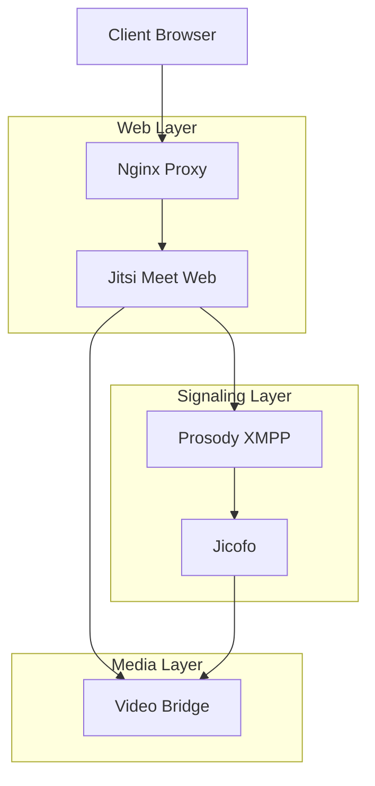

# Jitsi Integration - Server Configuration Guide

This guide details the server-side configuration required for integrating Jitsi Meet with Janssen IAM.

## Table of Contents
- [Component Overview](#component-overview)
- [Prerequisites](#prerequisites)
- [Installation](#installation)
- [Component Configuration](#component-configuration)
- [SSL Configuration](#ssl-configuration)
- [Network Configuration](#network-configuration)
- [Testing & Validation](#testing--validation)

## Component Overview

### Server Components
1. Jitsi Meet Web
2. Prosody XMPP Server
3. Jitsi Videobridge (JVB)
4. Jicofo (Conference Focus)
5. Nginx/Apache Web Server

### System Architecture


## Prerequisites

### System Requirements
```bash
# Minimum specifications
CPU: 4 cores
RAM: 8GB
Storage: 50GB
Network: 1Gbps
OS: Ubuntu 20.04+ or Debian 11+

# Required packages
apt-get install -y \
    nginx \
    certbot \
    python3-certbot-nginx \
    apt-transport-https \
    ca-certificates \
    curl \
    gnupg2 \
    software-properties-common
```

### Network Requirements
```bash
# Required ports
443/tcp   # HTTPS
10000/udp # RTP/SRTP
4443/tcp  # JVB Harvester
5222/tcp  # XMPP
5347/tcp  # Jicofo Component
```

## Installation

### 1. Repository Setup
```bash
# Add Jitsi repository
curl https://download.jitsi.org/jitsi-key.gpg.key | sudo sh -c 'gpg --dearmor > /usr/share/keyrings/jitsi-keyring.gpg'
echo 'deb [signed-by=/usr/share/keyrings/jitsi-keyring.gpg] https://download.jitsi.org stable/' | sudo tee /etc/apt/sources.list.d/jitsi-stable.list > /dev/null

# Update package lists
sudo apt update
```

### 2. Core Components Installation
```bash
# Install Jitsi Meet
sudo apt install -y jitsi-meet

# During installation, provide:
# - Hostname: meet.your.domain
# - SSL Certificate: Let's Encrypt (recommended)
```

### 3. Additional Components
```bash
# Install additional required packages
sudo apt install -y \
    jitsi-meet-tokens \
    jitsi-meet-turnserver \
    lua-sqlite3
```

## Component Configuration

### 1. Prosody Configuration
```lua
-- /etc/prosody/conf.avail/meet.your.domain.cfg.lua
VirtualHost "meet.your.domain"
    authentication = "token"
    ssl = {
        key = "/etc/prosody/certs/meet.your.domain.key";
        certificate = "/etc/prosody/certs/meet.your.domain.crt";
    }
    modules_enabled = {
        "bosh";
        "pubsub";
        "ping";
        "speakerstats";
        "conference_duration";
        "token_verification";
    }
    c2s_require_encryption = true
    admins = { "focus@auth.meet.your.domain" }

Component "conference.meet.your.domain" "muc"
    storage = "memory"
    modules_enabled = {
        "muc_meeting_id";
        "muc_domain_mapper";
        "token_verification";
    }
    admins = { "focus@auth.meet.your.domain" }
    muc_room_locking = false
    muc_room_default_public_jids = true

Component "jvb.meet.your.domain"
    component_secret = "${jvb_secret}"
```

### 2. Jicofo Configuration
```hocon
# /etc/jitsi/jicofo/jicofo.conf
jicofo {
    authentication {
        enabled = true
        type = "JWT"
        login-url = "https://meet.your.domain/static/oauth.html"
        token-verification {
            enabled = true
            jwt-issuer = "https://your.janssen.domain"
            jwt-audience = "jitsi"
            jwt-accepted-algorithms = ["RS256"]
            jwt-key-name = "jitsi"
        }
    }
    
    bridge {
        brewery-jid = "JvbBrewery@internal.auth.meet.your.domain"
        selection-strategy = "RegionBasedBridgeSelectionStrategy"
    }
    
    conference {
        initial-timeout = 15 seconds
        max-audio-senders = 50
        max-video-senders = 50
    }
    
    xmpp {
        client {
            enabled = true
            hostname = "localhost"
            domain = "auth.meet.your.domain"
            username = "focus"
            password = "${jicofo_secret}"
            conference-muc-jid = "conference.meet.your.domain"
            client-proxy = "focus.meet.your.domain"
        }
    }
}
```

### 3. Videobridge Configuration
```hocon
# /etc/jitsi/videobridge/jvb.conf
videobridge {
    ice {
        udp {
            port = 10000
        }
        tcp {
            enabled = true
            port = 4443
        }
    }
    
    apis {
        xmpp-client {
            configs {
                xmpp-server-1 {
                    hostname = "localhost"
                    domain = "auth.meet.your.domain"
                    username = "jvb"
                    password = "${jvb_secret}"
                    muc_jids = "JvbBrewery@internal.auth.meet.your.domain"
                    muc_nickname = "${instance_id}"
                }
            }
        }
    }
    
    websockets {
        enabled = true
        server-id = "${instance_id}"
        domain = "meet.your.domain"
    }
    
    stats {
        enabled = true
        transport = ["muc", "colibri"]
    }
}
```

### 4. Web Configuration
```javascript
// /etc/jitsi/meet/meet.your.domain-config.js
var config = {
    hosts: {
        domain: 'meet.your.domain',
        muc: 'conference.meet.your.domain',
        focus: 'focus.meet.your.domain'
    },
    
    enableUserRolesBasedOnToken: true,
    enableTalkWhileMuted: false,
    disableAudioLevels: false,
    
    channelLastN: 20,
    
    p2p: {
        enabled: true,
        stunServers: [
            { urls: 'stun:meet-jit-si-turnrelay.jitsi.net:443' }
        ]
    },
    
    analytics: {
        whiteListedEvents: ['endpoint.stats']
    },
    
    deploymentInfo: {
        environment: 'production',
        envType: 'prod',
        releaseNumber: '1.0.0',
        shard: 'shard1'
    }
};
```

## SSL Configuration

### 1. Let's Encrypt Setup
```bash
# Install certbot
sudo apt install -y certbot python3-certbot-nginx

# Generate certificate
sudo certbot --nginx -d meet.your.domain

# Configure auto-renewal
sudo systemctl enable certbot.timer
sudo systemctl start certbot.timer
```

### 2. Certificate Distribution
```bash
# Copy certificates to Prosody
sudo cp /etc/letsencrypt/live/meet.your.domain/fullchain.pem \
    /etc/prosody/certs/meet.your.domain.crt
sudo cp /etc/letsencrypt/live/meet.your.domain/privkey.pem \
    /etc/prosody/certs/meet.your.domain.key

# Set permissions
sudo chown root:prosody /etc/prosody/certs/meet.your.domain.*
sudo chmod 640 /etc/prosody/certs/meet.your.domain.*
```

## Network Configuration

### 1. Firewall Rules
```bash
# UFW configuration
sudo ufw allow 80/tcp
sudo ufw allow 443/tcp
sudo ufw allow 10000/udp
sudo ufw allow 4443/tcp
sudo ufw allow 5222/tcp
sudo ufw allow 5347/tcp

# Apply rules
sudo ufw enable
```

### 2. Nginx Configuration
```nginx
server {
    listen 443 ssl http2;
    server_name meet.your.domain;

    ssl_certificate /etc/letsencrypt/live/meet.your.domain/fullchain.pem;
    ssl_certificate_key /etc/letsencrypt/live/meet.your.domain/privkey.pem;
    
    # Modern SSL configuration
    ssl_protocols TLSv1.2 TLSv1.3;
    ssl_ciphers ECDHE-ECDSA-AES128-GCM-SHA256:ECDHE-RSA-AES128-GCM-SHA256:ECDHE-ECDSA-AES256-GCM-SHA384:ECDHE-RSA-AES256-GCM-SHA384:ECDHE-ECDSA-CHACHA20-POLY1305:ECDHE-RSA-CHACHA20-POLY1305:DHE-RSA-AES128-GCM-SHA256:DHE-RSA-AES256-GCM-SHA384;
    ssl_prefer_server_ciphers off;
    
    # CORS configuration
    add_header 'Access-Control-Allow-Origin' 'https://your.janssen.domain' always;
    add_header 'Access-Control-Allow-Methods' 'GET, POST, OPTIONS' always;
    add_header 'Access-Control-Allow-Headers' 'DNT,X-CustomHeader,Keep-Alive,User-Agent,X-Requested-With,If-Modified-Since,Cache-Control,Content-Type,Authorization' always;
    
    location = /external_api.js {
        alias /usr/share/jitsi-meet/libs/external_api.min.js;
    }
    
    location / {
        root /usr/share/jitsi-meet;
        index index.html;
        try_files $uri $uri/ =404;
    }
    
    # BOSH
    location /http-bind {
        proxy_pass http://localhost:5280/http-bind;
        proxy_set_header X-Forwarded-For $remote_addr;
        proxy_set_header Host $http_host;
    }
}
```

## Testing & Validation

### 1. Component Tests
```bash
# Check Prosody
sudo prosodyctl check

# Test Jicofo
sudo systemctl status jicofo

# Verify Videobridge
sudo systemctl status jitsi-videobridge2

# Check web server
sudo nginx -t
```

### 2. Integration Tests
```bash
# Test XMPP connection
nc -zv localhost 5222

# Check BOSH endpoint
curl -I https://meet.your.domain/http-bind

# Verify JWT authentication
curl -X POST https://meet.your.domain/room/test \
  -H "Authorization: Bearer ${test_token}"
```

### 3. Monitoring Commands
```bash
# Watch videobridge statistics
watch -n1 "sudo jitsi-stats-dump -c /etc/jitsi/videobridge/config"

# Check Prosody connections
sudo prosodyctl c2s:list

# Monitor conference focus
tail -f /var/log/jitsi/jicofo.log
```

## Additional Resources
- [Jitsi Meet Documentation](https://jitsi.github.io/handbook/)
- [Prosody Documentation](https://prosody.im/doc/)
- [Security Configuration Guide](jitsi-security.md)
- [Monitoring Guide](jitsi-monitoring.md)
