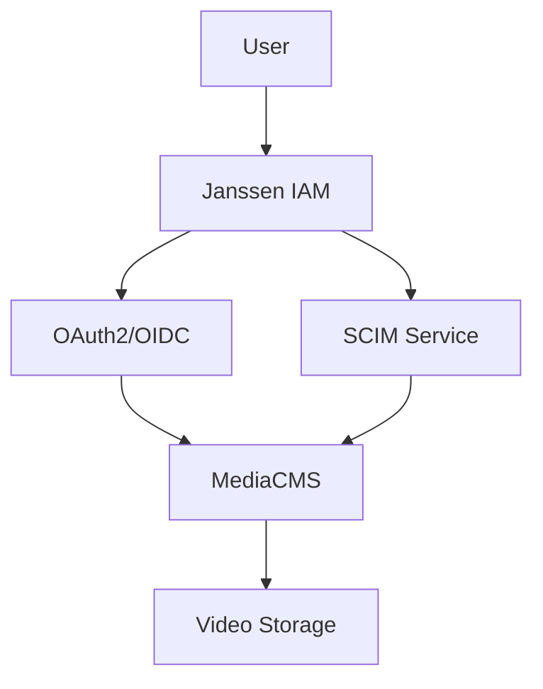

# MediaCMS Integration Guide

A guide for integrating Janssen IAM with MediaCMS (mediacms.io) for video content management and access control.

## Table of Contents
- [Overview](#overview)
- [Prerequisites](#prerequisites)
- [Configuration](#configuration)
- [Integration Implementation](#integration-implementation)
- [Access Control](#access-control)
- [Security Considerations](#security-considerations)
- [API Integration](#api-integration)
- [Troubleshooting](#troubleshooting)

## Overview

### Integration Features
- Single Sign-On (SSO) via OAuth2/OpenID Connect
- Role-based video access control
- Content permission management
- User activity tracking
- Video asset protection
- API integration

### Architecture


## Prerequisites
- MediaCMS server
- Janssen Server 1.1.1+
- Valid SSL certificates
- API access enabled
- HTTPS configured
- CDN (optional)

## Configuration

### 1. Janssen OAuth2 Setup
```json
{
  "client_name": "mediacms_oauth2",
  "client_id": "${generated_client_id}",
  "client_secret": "${generated_client_secret}",
  "application_type": "web",
  "grant_types": ["authorization_code", "refresh_token"],
  "scope": ["openid", "profile", "email", "roles"],
  "redirect_uris": ["https://your.mediacms.domain/oauth2/callback"]
}
```

### 2. MediaCMS Configuration
```python
OAUTH2_PROVIDER = {
    'NAME': 'Janssen IAM',
    'CLIENT_ID': '${client_id_from_janssen}',
    'CLIENT_SECRET': '${client_secret_from_janssen}',
    'AUTHORIZE_URL': 'https://your.janssen.domain/oauth/authorize',
    'TOKEN_URL': 'https://your.janssen.domain/oauth/token',
    'USERINFO_URL': 'https://your.janssen.domain/oauth/userinfo',
    'ROLE_ATTRIBUTE': 'mediacms_roles'
}
```

## Integration Implementation

### Core Service
```dart
class MediaCMSService {
  final HttpService _httpService;
  final TokenService _tokenService;

  Future<void> configureAccess(String videoId, AccessPolicy policy) async {
    final token = await _tokenService.getToken();
    await _httpService.post(
      '/api/videos/$videoId/access',
      headers: {'Authorization': 'Bearer $token'},
      body: policy.toJson(),
    );
  }

  Future<String> getStreamingUrl(String videoId) async {
    final token = await _tokenService.getToken();
    final response = await _httpService.get(
      '/api/videos/$videoId/stream',
      headers: {'Authorization': 'Bearer $token'},
    );
    return response['url'];
  }
}
```

## Access Control

### Role Mapping
```json
{
  "role_mappings": {
    "content_admin": ["mediacms_admin"],
    "content_manager": ["mediacms_manager"],
    "viewer": ["mediacms_viewer"]
  }
}
```

### Permission Implementation
```dart
class AccessControl {
  Future<bool> checkAccess(String userId, String videoId) async {
    final userRoles = await _getRoles(userId);
    final videoPolicy = await _getVideoPolicy(videoId);
    return _evaluateAccess(userRoles, videoPolicy);
  }
}
```

## Security Considerations
- Enable SSL/TLS
- Configure content encryption
- Implement token-based access
- Set up IP restrictions if needed
- Regular token rotation
- Audit logging
- Access monitoring
- Content validation

## API Integration

### Basic Usage
```dart
final mediaService = MediaCMSService(httpService, tokenService);

// Upload video
await mediaService.uploadVideo(
  title: 'Test Video',
  file: videoFile,
  access: AccessPolicy.private,
);

// Get video URL
final url = await mediaService.getStreamingUrl('video-id');
```

## Troubleshooting

### Common Issues
1. CORS configuration
2. Token expiration
3. Role synchronization
4. Content access errors

### Debugging
```dart
// Enable debug logging
MediaCMSService.enableDebug();

// Monitor API calls
mediaService.onRequest.listen((request) {
  print('API Request: ${request.method} ${request.url}');
});
```

## Additional Resources
- [MediaCMS Documentation](https://mediacms.io/docs)
- [API Reference](https://mediacms.io/api)
- [OAuth2 Configuration](oauth2-configuration.md)
- [Security Guide](security.md)
