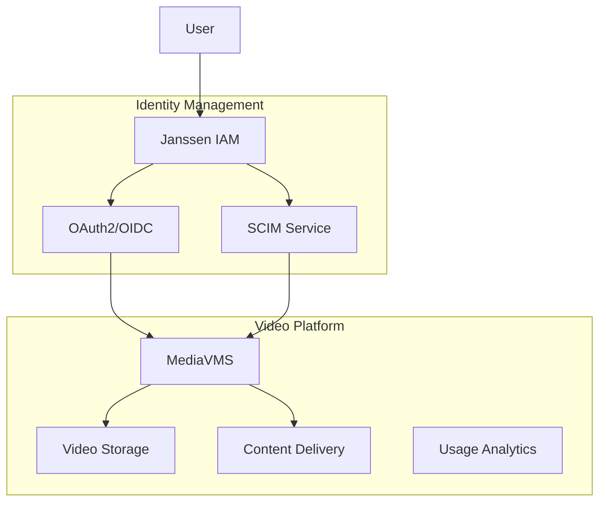

# MediaVMS Integration Guide

This guide details the integration between Janssen IAM and MediaVMS (Video Management System), providing centralized authentication, access control, and content management.

## Table of Contents
- [Overview](#overview)
- [Prerequisites](#prerequisites)
- [Architecture](#architecture)
- [Janssen Configuration](#janssen-configuration)
- [MediaVMS Configuration](#mediavms-configuration)
- [Integration Implementation](#integration-implementation)
- [Video Access Control](#video-access-control)
- [Content Management](#content-management)
- [Security Considerations](#security-considerations)
- [Troubleshooting](#troubleshooting)

## Overview

### Integration Features
- Single Sign-On (SSO) via OAuth2/OpenID Connect
- Role-based video access control
- Content permission management
- User activity tracking
- Video asset protection
- Streaming authorization
- Content encryption management
- API integration

### Architecture


## Prerequisites

### MediaVMS Requirements
- MediaVMS Server 2.0+
- Video storage configured
- CDN integration
- API access enabled
- Administrator access

### Janssen Requirements
- Janssen Server 1.1.1+
- OAuth2/OpenID Connect configured
- SCIM service enabled
- Admin credentials

### Network Requirements
- HTTPS enabled
- Valid SSL certificates
- CDN configuration
- Streaming ports configured
- API endpoints accessible

## Janssen Configuration

### 1. OAuth2 Client Setup
```json
{
  "client_name": "mediavms_oauth2",
  "client_id": "${generated_client_id}",
  "client_secret": "${generated_client_secret}",
  "token_endpoint_auth_method": "client_secret_post",
  "application_type": "web",
  "grant_types": [
    "authorization_code",
    "refresh_token"
  ],
  "response_types": ["code"],
  "scope": [
    "openid",
    "profile",
    "email",
    "roles",
    "mediavms"
  ],
  "redirect_uris": [
    "https://your.mediavms.domain/oauth2/callback"
  ]
}
```

### 2. Video Access Role Mapping
```json
{
  "role_mappings": {
    "content_admin": ["video_admin", "uploader"],
    "content_manager": ["video_manager"],
    "viewer": ["video_viewer"],
    "encoder": ["transcoding_service"]
  }
}
```

### 3. Permission Scopes
```json
{
  "scopes": {
    "video_admin": {
      "permissions": ["create", "read", "update", "delete", "manage"],
      "content_types": ["all"]
    },
    "video_manager": {
      "permissions": ["create", "read", "update"],
      "content_types": ["assigned"]
    },
    "video_viewer": {
      "permissions": ["read"],
      "content_types": ["public", "authorized"]
    }
  }
}
```

## MediaVMS Configuration

### 1. Authentication Setup
```python
# auth_config.py
config = {
    'oauth2_provider': {
        'name': 'Janssen IAM',
        'client_id': '${client_id_from_janssen}',
        'client_secret': '${client_secret_from_janssen}',
        'authorize_url': 'https://your.janssen.domain/oauth/authorize',
        'token_url': 'https://your.janssen.domain/oauth/token',
        'userinfo_url': 'https://your.janssen.domain/oauth/userinfo',
        'scopes': ['openid', 'profile', 'email', 'roles'],
        'role_attribute': 'mediavms_roles'
    },
    'jwt_settings': {
        'algorithm': 'RS256',
        'signing_key': '/path/to/jwt/private.key',
        'verifying_key': '/path/to/jwt/public.key',
        'audience': 'mediavms',
        'issuer': 'janssen'
    }
}
```

### 2. CDN Configuration
```yaml
cdn:
  provider: cloudfront
  domain: cdn.your.domain
  signed_urls:
    enabled: true
    key_pair_id: XXXXXXXXX
    private_key_path: /path/to/cdn/private.key
    expiry: 3600

  security:
    ip_whitelist:
      enabled: true
      ranges: []
    geo_restriction:
      enabled: false
      countries: []
    token_auth:
      enabled: true
      key: ${generated_token_key}
```

### 3. Video Access Rules
```yaml
access_rules:
  default_policy: deny
  public_access:
    enabled: false
    requires_auth: true
    
  roles:
    video_admin:
      allow: ["*"]
    video_manager:
      allow: ["view", "upload", "edit", "share"]
      restrict: ["delete"]
    video_viewer:
      allow: ["view"]
      restrict: ["download"]

  content_restrictions:
    enable_drm: true
    enable_watermarking: true
    download_policy: authenticated_only
```

## Integration Implementation

### 1. MediaVMS Integration Service
```dart
/// MediaVMS integration service implementation
class MediaVMSIntegrationService implements ServiceIntegration {
  final HttpService _httpService;
  final TokenService _tokenService;
  final CDNService _cdnService;

  Future<VideoResource> createVideo({
    required String title,
    required String description,
    required String filePath,
    VideoAccessPolicy? accessPolicy,
  }) async {
    final token = await _tokenService.getToken();
    final uploadUrl = await _getUploadUrl(filePath);
    
    await _uploadVideo(uploadUrl, filePath);
    
    final video = await _createVideoMetadata(
      title: title,
      description: description,
      accessPolicy: accessPolicy,
    );
    
    return video;
  }

  Future<String> generateStreamingUrl(
    String videoId,
    StreamingOptions options,
  ) async {
    final video = await _getVideo(videoId);
    final cdnUrl = await _cdnService.getStreamingUrl(
      video,
      options,
    );
    
    return _signUrl(cdnUrl, options.expiry);
  }
}
```

### 2. Access Control
```dart
/// Video access control implementation
class VideoAccessControl {
  final MediaVMSIntegrationService _mediaService;
  final RoleManager _roleManager;

  Future<void> updateVideoAccess({
    required String videoId,
    required VideoAccessPolicy policy,
  }) async {
    final video = await _mediaService.getVideo(videoId);
    
    // Update access rules
    await _mediaService.updateVideoPolicy(
      videoId,
      policy,
    );
    
    // Update CDN configuration
    await _updateCDNRules(video, policy);
    
    // Update encryption if needed
    if (policy.requiresEncryption) {
      await _enableEncryption(video);
    }
  }

  Future<bool> checkAccess(
    String userId,
    String videoId,
  ) async {
    final userRoles = await _roleManager.getUserRoles(userId);
    final video = await _mediaService.getVideo(videoId);
    
    return _evaluateAccess(userRoles, video);
  }
}
```

### 3. Content Management
```dart
/// Content management implementation
class ContentManager {
  final MediaVMSIntegrationService _mediaService;
  final EncodingService _encodingService;

  Future<void> processVideo(String videoId) async {
    try {
      // Start encoding process
      final job = await _encodingService.createJob(videoId);
      
      // Monitor progress
      await _monitorEncoding(job.id);
      
      // Generate thumbnails
      await _generateThumbnails(videoId);
      
      // Update video status
      await _mediaService.updateVideoStatus(
        videoId,
        VideoStatus.ready,
      );
    } catch (e) {
      await _handleProcessingError(videoId, e);
    }
  }

  Future<void> updateMetadata(
    String videoId,
    VideoMetadata metadata,
  ) async {
    await _mediaService.updateVideo(
      videoId,
      metadata,
    );
  }
}
```

## Video Access Control

### 1. Permission Management
```dart
/// Permission management implementation
class VideoPermissionManager {
  final MediaVMSIntegrationService _mediaService;
  final UserService _userService;

  Future<void> grantAccess(
    String videoId,
    String userId,
    VideoPermission permission,
  ) async {
    final user = await _userService.getUser(userId);
    final video = await _mediaService.getVideo(videoId);
    
    await _mediaService.grantPermission(
      videoId: videoId,
      userId: userId,
      permission: permission,
    );
    
    await _updateAccessLog(video, user, permission);
  }

  Future<void> revokeAccess(
    String videoId,
    String userId,
  ) async {
    await _mediaService.revokePermission(
      videoId: videoId,
      userId: userId,
    );
  }
}
```

### 2. Access Control Lists
```dart
/// ACL implementation
class VideoACL {
  Future<void> updateACL(
    String videoId,
    Map<String, VideoPermission> permissions,
  ) async {
    final acl = ACLConfig(
      resource: videoId,
      resourceType: 'video',
      permissions: permissions,
    );
    
    await _mediaService.updateACL(acl);
  }

  Future<List<AccessRule>> getAccessRules(
    String videoId,
  ) async {
    final acl = await _mediaService.getACL(videoId);
    return acl.rules;
  }
}
```

## Content Management

### 1. Video Processing
```dart
/// Video processing implementation
class VideoProcessor {
  final EncodingService _encodingService;
  final StorageService _storageService;

  Future<void> processUpload(
    String videoId,
    Stream<List<int>> videoStream,
  ) async {
    // Store original file
    final storagePath = await _storageService.store(
      videoId,
      videoStream,
    );
    
    // Create encoding jobs
    final jobs = await Future.wait([
      _createHLSJob(videoId, storagePath),
      _createDashJob(videoId, storagePath),
      _createMP4Job(videoId, storagePath),
    ]);
    
    // Monitor encoding progress
    await _monitorJobs(jobs);
  }

  Future<void> _monitorJobs(List<EncodingJob> jobs) async {
    await Future.wait(
      jobs.map((job) => _monitorJob(job)),
    );
  }
}
```

### 2. Video Analytics
```dart
/// Analytics implementation
class VideoAnalytics {
  Future<VideoStats> collectStats(String videoId) async {
    final views = await _getViewCount(videoId);
    final bandwidth = await _getBandwidthUsage(videoId);
    final regions = await _getViewerRegions(videoId);
    
    return VideoStats(
      videoId: videoId,
      views: views,
      bandwidth: bandwidth,
      regions: regions,
      timestamp: DateTime.now(),
    );
  }

  Stream<ViewerEvent> watchViewerEvents(String videoId) async* {
    await for (final event in _mediaService.viewerEvents(videoId)) {
      yield ViewerEvent(
        videoId: videoId,
        userId: event.userId,
        action: event.action,
        timestamp: event.timestamp,
      );
    }
  }
}
```

## Security Considerations

### 1. Content Protection
```dart
/// Content protection implementation
class ContentProtection {
  Future<void> enableDRM(String videoId) async {
    final drmConfig = DRMConfig(
      provider: 'widevine',
      keyId: await _generateKeyId(),
      key: await _generateKey(),
    );
    
    await _mediaService.enableDRM(
      videoId,
      drmConfig,
    );
  }

  Future<void> enableWatermarking(String videoId) async {
    final watermarkConfig = WatermarkConfig(
      text: '{{user_id}}',
      position: WatermarkPosition.bottomRight,
      opacity: 0.5,
    );
    
    await _mediaService.enableWatermarking(
      videoId,
      watermarkConfig,
    );
  }
}
```

### 2. URL Security
```dart
/// URL security implementation
class URLSecurity {
  String generateSignedUrl(
    String url,
    Duration expiry,
  ) {
    final timestamp = DateTime.now()
        .add(expiry)
        .millisecondsSinceEpoch ~/ 1000;
    
    final signature = _signUrl(
      url,
      timestamp.toString(),
    );
    
    return '$url?expires=$timestamp&signature=$signature';
  }

  bool validateSignedUrl(String signedUrl) {
    final uri = Uri.parse(signedUrl);
    final expires = int.parse(
      uri.queryParameters['expires'] ?? '0'
    );
    
    if (expires < DateTime.now().millisecondsSinceEpoch ~/ 1000) {
      return false;
    }
    
    final signature = uri.queryParameters['signature'];
    final expectedSignature = _signUrl(
      uri.path,
      expires.toString(),
    );
    
    return signature == expectedSignature;
  }
}
```

## Troubleshooting

### 1. Diagnostics
```dart
/// Diagnostic tools implementation
class MediaDiagnostics {
  Future<DiagnosticReport> checkVideoHealth(
    String videoId,
  ) async {
    final report = DiagnosticReport();
    
    try {
      // Check storage
      report.addResult(await _checkStorage(videoId));
      
      // Check encodings
      report.addResult(await _checkEncodings(videoId));
      
      // Check CDN
      report.addResult(await _checkCDN(videoId));
      
      // Check DRM
      report.addResult(await _checkDRM(videoId));
      
    } catch (e) {
      report.addError(e.toString());
    }
    
    return report;
  }
}
```

### 2. Error Recovery
```dart
/// Error recovery implementation
class ErrorRecovery {
  Future<void> recoverVideo(String videoId) async {
    // Check video status
    final status = await _mediaService.getVideoStatus(videoId);
    
    switch (status) {
      case Video